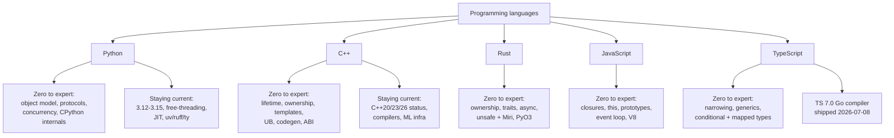

# Programming languages

⏱ 9 min read · +10 min resources

Last full refresh: 2026-08-31 (time estimates and the expanded track descriptions added the same day).

**Restructured 2026-08-31 (Khalid's call).** Previously Python and C++ were "stay current" tracks on the assumption of existing fluency. All five languages are now written as **zero to expert**, complete from first principles, with the currency material kept as separate companion pages. Working knowledge is assumed nowhere; if a stage is already known, its gate question makes that fast to confirm.

Diagram source (mermaid)

## The shared ladder

Every language page uses the same five stages, so progress is comparable across them. Each stage lists what to learn, one thing to build, and a **gate**: a question you should be able to answer cold before moving on.

| Stage | Means |
|---|---|
| 0. Setup and mental model | Toolchain working, and the one or two ideas the whole language is organised around |
| 1. Foundations | Write correct small programs; types, control flow, data structures, errors |
| 2. Working proficiency | Ship idiomatic code others can maintain; the language's core abstraction mechanism |
| 3. Advanced | The hard parts: concurrency, performance, memory, metaprogramming, failure modes |
| 4. Expert | Explain behaviour from the spec or implementation, contribute to the ecosystem, teach it |

**Using this as a refresher rather than a course**: read the Stage 3 gate first. If you can answer it, you only need Stage 4 plus the traps list. If you cannot, the gap is usually one stage down, not at the beginning.

## The five tracks

- **Python**: the working language, so the ladder is aimed at the parts you can use daily for years without ever meeting. The **data model** is the set of dunder protocols (`__len__`, `__iter__`, `__eq__` with `__hash__`, `__enter__`) through which every built-in operation dispatches; learning it is what turns "knows Python" into "writes Python that other people can extend". **Descriptors** are the `__get__`/`__set__` protocol behind `property`, `classmethod`, and bound methods themselves, and they are the mechanism that makes ORM and framework magic explicable instead of mysterious. **asyncio** is cooperative single-threaded concurrency where `await` marks the yield points, which makes it the right tool for high-concurrency IO and the wrong tool for CPU work. CPython's **specialising adaptive interpreter** (PEP 659) rewrites hot bytecode into type-specialised forms with inline caches while the program runs, which is why a loop over stable types gets faster on its own and why breaking type stability costs more than it looks. The companion page tracks **3.12 to 3.15**, **free-threading** (the officially supported GIL-free build, which finally makes threads useful for CPU-bound Python), the **JIT** (copy-and-patch, shipped but still experimental and off by default), and the **uv/ruff/ty** stack (Astral's Rust rewrites of the installer, the linter and formatter, and the type checker, each one to two orders of magnitude faster than what it replaces).
- **C++**: the substrate under every inference engine, kernel, and binding layer. The ladder is organised around **object lifetime**, the question of when each object is created and destroyed and who is responsible for it, because C++ hands that responsibility to you and **RAII** (tying a resource's release to a destructor that runs deterministically at end of scope) is the language's entire answer. That is why dangling references and use-after-free are the characteristic C++ bugs rather than incidental ones. The second organising fact is **undefined behaviour**: the optimiser is allowed to assume your program never invokes it, so a UB bug does not give a wrong answer, it gives a program with no defined meaning at all. The companion page tracks **C++20** (concepts to constrain templates, lazy ranges, coroutines, modules), **C++23** (`std::expected` for error returns without exceptions, `std::mdspan` as the standard way to pass a tensor view across a library boundary), **C++26** (static reflection, contracts, and `std::execution` senders and receivers as the standard async model), and which compilers actually implement each.
- **Rust**: **ownership** means every value has exactly one owner and the compiler tracks it, so memory safety and data-race freedom are proved before the program runs rather than tested for afterwards. That one rule is what buys C++-level performance without C++'s failure modes, and it is why the borrow checker rejecting your code usually means the design is wrong rather than the language is in the way. Rust is increasingly the language of the Python toolchain itself (**uv** the installer, **ruff** the linter, **ty** the type checker, **tokenizers** the BPE implementation under transformers, **polars** the lazy DataFrame engine, **pydantic-core** the validation kernel), so you already run it daily. The page ends at **`unsafe`** (the blocks where you take the safety obligation back from the compiler, the expert skill being to wrap them in an abstraction whose invariant you can state precisely), **Miri** (an interpreter that actually detects undefined behaviour in unsafe code, the tool C++ has no real equivalent of), and **PyO3** (the crate that exposes Rust functions to CPython, which is how all those libraries ship as wheels). The C++ mapping is kept as an optional appendix.
- **JavaScript**: needed because agent harnesses, MCP servers, and dev tooling live there. The ladder is four ideas that explain almost every surprise in the language. **Closures** capture variables rather than values from the defining scope, which is the basis of nearly every callback API and the source of the classic loop-variable bug. **`this`** is bound by the call site rather than by the definition, which is why passing a method as a callback silently loses it and why arrow functions (which capture `this` lexically) exist. **Prototypes** are objects delegating property lookup to other objects, with `class` and `extends` being syntax over that rather than a separate system, so understanding the chain once makes framework magic stop being magic. The **event loop** is a single thread draining a task queue, with a microtask queue for promise callbacks that is drained completely between tasks, which is what fixes execution order and why one synchronous blocking call stalls the entire process. Then **V8's optimisation model**: hidden classes and inline caches make objects with consistent shapes fast, and building objects by adding properties in varying order makes them slow.
- **TypeScript**: a compile-time type language over JavaScript, erased entirely before anything runs, so it never changes behaviour and never validates data arriving from a network or an environment variable. The ladder ends in **conditional types** (`T extends U ? X : Y`, with `infer` to destructure a type, which is how a library's types adapt to whatever you hand it), **mapped types** (`{ [K in keyof T]: ... }`, deriving one object shape from another so that a schema and the handler types built from it cannot drift apart), **variance** (whether a function taking `Animal` is substitutable where one taking `Dog` is expected, which is the rule behind most confusing assignability errors), and the **deliberate unsoundness** the language chose on purpose (bivariant method parameters, unsoundly covariant arrays, `any`, type assertions), which you have to know in order to predict where the checker will not save you. **TS 7.0** (2026-07-08) is the compiler rewritten as a native Go binary: a port, not a redesign, so type-checking semantics are unchanged and builds are roughly 10x faster. It matters as a migration rather than an upgrade, because it shipped without a stable programmatic API and the tooling that consumes one lagged behind.

## Adjacent (not a track)

- **Mojo** is Modular's systems language for accelerators: Python-like syntax with static types, ownership, and compile-time metaprogramming, compiled through MLIR so one source file can target CPU and GPU. It aims squarely at the slot currently filled by writing kernels in CUDA C++ and calling them from Python, with one language instead of two, which is why it is worth watching from here even though nothing in this KB depends on it yet. Added 2026-08-24: Mojo is now open source at 1.0. Modular, whose acquisition by Qualcomm closed in late July, released the Mojo compiler under Apache 2.0 on Aug 18 (with LLVM exceptions for distributing compiled binaries), alongside ModCon announcements pitching "open source, open cloud, open silicon" and a Qualcomm data-center accelerator integration. [Announcement](https://www.modular.com/blog/mojo-open-source) (~10 min)

## Files

| File | Contents |
|---|---|
| [python.md](python.md) (18 min read · +66h resources) | Python zero to expert: five stages, gates, traps |
| [python-staying-current.md](python-staying-current.md) (10 min read · +5h 50m resources) | Python 3.12-3.15 changes, GIL/JIT status, modern tooling (uv, ruff, ty), async, packaging |
| [cpp.md](cpp.md) (18 min read · +84h resources) | C++ zero to expert: lifetime, ownership, templates, UB, codegen, ABI |
| [cpp-staying-current.md](cpp-staying-current.md) (9 min read · +5h 20m resources) | C++20 recap, C++23/26 status and compiler support, C++ in ML infra, modern hygiene |
| [rust.md](rust.md) (21 min read · +40h resources) | Rust zero to expert, toolchain, ML ecosystem, PyO3, C++ translation appendix |
| [javascript.md](javascript.md) (16 min read · +47h 30m resources) | JavaScript zero to expert: closures, `this`, prototypes, event loop, V8, runtimes |
| [typescript.md](typescript.md) (17 min read · +34h 45m resources) | TypeScript zero to expert: narrowing, generics, type-level programming, TS 7.0 |

## Cross-links

- CUDA/kernels: `../cuda-and-gpu-programming/`
- Inference engines built in C++/Rust: `../inference-and-serving/`
- PyTorch's C++ core and extensions: `../pytorch-ecosystem/`
- Harnesses and MCP servers written in TS/JS: `../agentic-harnesses/`, `../protocols/`
