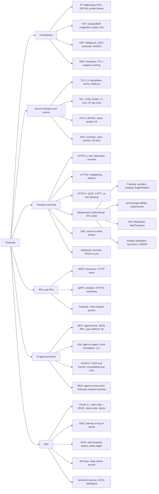

# Topic: protocols

⏱ 14 min read · +16h 18m resources

Software protocols an AI engineer actually touches: how bytes move (HTTP versions, sockets, streams), how services talk (REST, gRPC, GraphQL), how agents talk (MCP and A2A: the Model Context Protocol for agent-to-tool, Agent2Agent for agent-to-agent), and how everything authenticates. Updated 2026-09-21 (the September Paper2Agent, Google Home MCP and credential-handling items were folded into the map).

### Taxonomy

### Map of the space

- **Foundations**: throughput is window over RTT, so bandwidth-delay product, window scaling, and loss decide real transfer speed; a single TCP stream cannot fill a long fat pipe, which is why NCCL (NVIDIA Collective Communications Library, the collective layer underneath every multi-GPU training job) opens 16 sockets per peer on AWS and why checkpoint uploads need concurrency. UDP is a thin wrapper you must tune yourself, since unlike TCP it has no receive-buffer autotuning, and it is the substrate for two things you care about: **QUIC**, the encrypted, multiplexed transport under HTTP/3 that moves loss recovery per-stream so one dropped packet no longer stalls every other stream on the connection, and **RoCEv2** (RDMA over Converged Ethernet v2), which encapsulates remote direct memory access in UDP on port 4791 so GPU nodes exchange tensors without the kernel network stack in the path, at the price of requiring a near-lossless fabric. Details: [TCP, UDP, and IP: the transport foundations](tcp-udp-ip.md). Naming sits on top: DNS breaks in ways that look like everything else, especially Kubernetes ndots amplification and negative caching. Details: [DNS: resolution, caching, and the failure modes](dns.md).
- **Secure transport and access**: **TLS 1.3** (Transport Layer Security) is the baseline everywhere: one round trip to a working session, forward secrecy mandatory rather than a configuration choice, and everything after the server's first message encrypted, the certificate included. **Post-quantum hybrid key exchange**, which runs a classical elliptic-curve exchange and the lattice-based ML-KEM side by side and mixes both secrets so the session survives if either scheme does, is past 60 percent of client traffic but only about 10 percent of origins, and certificate lifetimes fall to 47 days by 2029 with 10-day validation reuse, which ends manual issuance. Details: [TLS and PKI: handshake, certificates, and mTLS](tls-and-pki.md). **SSH** (Secure Shell) is the same story a layer up: hybrid post-quantum key exchange has been the default since OpenSSH 9.0, and SSH certificates (the server trusts one CA key instead of N users' public keys scattered across M nodes, with short validity and a revocation list) plus **ProxyJump** (the jump host relays an encrypted stream and never touches your keys) replace key sprawl and agent forwarding on clusters. Details: [SSH: protocol, keys, tunnels, and cluster workflows](ssh.md).
- **Transport/web**: HTTP/1.1 -> 2 -> 3 is a series of head-of-line-blocking fixes (app layer, then transport layer via QUIC). Semantics (methods, status codes, caching, retries, idempotency) are version-independent and matter more day-to-day than the wire format. LLM APIs are long-lived streaming HTTP: **SSE** (Server-Sent Events, an ordinary HTTP response with `Content-Type: text/event-stream` that never ends and carries one newline-delimited event per chunk) returned as the answer to a POST, careful timeouts at every proxy hop, and idempotency keys so a retried generation is not billed twice. Details: [HTTP: 1.1, 2, 3, and what matters for LLM services](http.md).
- **Real-time and events**: client only receives -> SSE (this is LLM token streaming and MCP's HTTP transport). True bidirectional or binary (voice agents) -> WebSockets, covered at wire level in [WebSocket protocol (RFC 6455) in depth](websockets.md): handshake, framing and masking, close codes, permessage-deflate, HTTP/2 bootstrapping, scaling, and the CSWSH failure mode (cross-site WebSocket hijacking: neither the same-origin policy nor CORS applies to a WebSocket handshake, so any page can open a socket to your endpoint with the user's cookies attached and read the replies, unless the server validates the `Origin` header itself). Cross-service "job done" notifications -> webhooks, which means verifying an HMAC-SHA256 signature computed over the raw request bytes (re-serialising the JSON breaks it), accepting that delivery is at-least-once and unordered, and writing consumers that dedupe on event id. Details: [Real-time and event delivery: WebSockets, SSE, webhooks, long polling](realtime-and-events.md).
- **RPC and APIs**. **RPC** (remote procedure call) is the style where a client invokes a named operation, as against REST's fixed verb set applied to named resources. **REST** at Richardson maturity level 2, meaning resources with URLs plus HTTP verbs and status codes used correctly, is the right answer for public APIs, because any client with an HTTP library can consume it and intermediaries can cache it. **gRPC** is the right answer for internal and inference infrastructure: services and messages are declared in **protobuf** (a compact binary format with numbered fields, so an old reader silently ignores a new field and schema evolution is safe), clients and servers are generated for a dozen languages, four streaming modes ride HTTP/2 streams over a single connection, and the caller sets an absolute **deadline** that propagates across hops so downstream services abandon work nobody is waiting for, which is real money when the work is a GPU forward pass. Its one production trap: a gRPC channel is one long-lived HTTP/2 connection, so an L4 load balancer pins every call to a single backend and you need L7 or client-side balancing. This is what Triton (NVIDIA's inference server), Ray, the vector databases, and OTLP (the OpenTelemetry wire protocol) all speak. **GraphQL** lets the client specify the shape of the response against a typed schema, which pays for itself when many heterogeneous UI clients hit the same backends, and rarely in ML serving. Details: [RPC and API styles: REST, gRPC, GraphQL](rpc-and-apis.md).
- **Agent protocols**. **MCP** (Model Context Protocol, Anthropic, November 2024) is how one agent reaches tools and context. It is JSON-RPC 2.0 between a **host** (the LLM application, which owns the model loop and all user consent), one **client** per connection, and **servers** that each expose a small capability surface: *tools* the model may call, *resources* the application may inject as context, and *prompts* the user may invoke. Two transports: **stdio**, where the host spawns the server as a subprocess and talks over its standard input and output, with zero network surface, and **Streamable HTTP**, a single endpoint that answers a POST either with JSON or by upgrading that same response into an SSE stream. Remote servers authenticate as OAuth 2.1 resource servers holding audience-bound tokens. The 2026-07-28 revision deleted the session handshake and made the core stateless, so a request carries its own version and capabilities and an ordinary gateway can route and cache it, and moved optional features into a formal extensions framework (Tasks for long-running work, MCP Apps for interactive UI). What MCP buys is that a server written once plugs into every harness; what it costs is that every tool result is untrusted text arriving inside the model's context, which is the whole prompt-injection surface. **A2A** (Agent2Agent, Google-origin, under the Linux Foundation since June 2025, v1.x with 150+ member organisations) solves the neighbouring problem, delegation between agents that are opaque to each other, where neither side sees the other's tools, prompts, or internal state. An agent publishes an **Agent Card**, a JSON document at a well-known URL describing its skills, endpoints, and authentication requirements; a client discovers it, opens a task with an explicit lifecycle (submitted, working, input-required, completed, failed), and receives updates over JSON-RPC on HTTP with SSE for streaming. It complements MCP rather than competing with it: MCP is agent-to-tool, A2A is agent-to-agent. The rest of the 2025 alphabet soup consolidated into A2A. IBM's **ACP** (Agent Communication Protocol) merged into it, and Cisco-led **AGNTCY** (an agent directory plus an identity scheme plus its own REST-flavoured **Agent Connect Protocol**, confusingly abbreviated ACP as well, and unrelated again to Zed's Agent Client Protocol for editors in [Topic: agentic-harnesses](../agentic-harnesses/summary.md)) moved under the Linux Foundation and archived its ACP SDK in April 2026. One measure of how regular the protocol's surface is: **MCP servers can be generated rather than written, at a 74% success rate.** Stanford's Paper2Agent (Nature, September 2026) converts a research paper plus its repository into a working agent exposed as MCP tools, one that reproduces the paper's results and runs the same analysis on new data, and it succeeded on **74 of 100 computational biology papers with no manual intervention**. Both halves of that number are informative. 74% says the protocol's surface is regular enough to target automatically, which is a real vindication of MCP's design: a tool schema plus a transport is a small enough contract that a model can fill it from a repository. The failing 26% is where the **operational knowledge** needed to actually run the code is absent from the repository, living instead in issue threads, undocumented environment assumptions and the authors' heads, which is exactly the gap named by the Repo-To-Skill work recorded on [Topic: agentic-harnesses](../agentic-harnesses/summary.md). The bottleneck on auto-generating MCP servers is therefore not the protocol and not the model, it is whether the source repository can be made to run. [Nature](https://www.nature.com/articles/s41586-026-11044-y), [MarkTechPost](https://www.marktechpost.com/2026/09/16/stanford-researchers-release-paper2agent-turning-research-papers-into-ai-agents-that-reproduce-results-and-run-on-new-data/) (10 min) Practical takeaway: build tool access on MCP, watch A2A for cross-organisation federation, and ignore the rest unless a platform forces it on you. Deep dive (MCP): [Model Context Protocol (MCP)](mcp.md).
- **Agent-to-instrument**: Anthropic opened a research preview of the **Model Hardware Standard (MHS)** on Aug 27, a shared specification for letting agents drive physical laboratory and manufacturing equipment: microscopes, liquid handlers, robotic arms, optical benches. It works with any device exposing a programmable interface, is model-agnostic, and is reachable by any harness over standard protocols including MCP, so it sits as a device-abstraction layer above MCP rather than as a competing transport. Reported early results: a drug-discovery run with real-time error handling at Genentech, an imaging experiment compressed from weeks to a day at HHMI Janelia, and laser stabilisation on QuEra's quantum computers going from 58% to 99.3%. Anthropic says it intends to open-source the standard. The interesting protocol question is the trust boundary: MCP's failure modes (prompt injection, confused deputy) are documented in [Model Context Protocol (MCP)](mcp.md) and are recoverable, whereas an agent driving a liquid handler is issuing irreversible physical actions, which is the same standing-authority problem the personal-agents page raises for resident agents. First preview is limited to selected research labs and advanced manufacturers. [Anthropic](https://www.anthropic.com/news/model-hardware-standard-research-preview) (10 min), [CNBC](https://www.cnbc.com/2026/08/27/anthropic-pushes-into-physical-world-with-new-standard-to-help-ai-agents-operate-machines.html) (8 min) The same boundary now exists on a consumer surface: **Google Home MCP** entered early access in September 2026, letting agents query device state and issue commands to home devices, and requiring a Premium Advanced subscription and a Cloud project. It is the first consumer-device MCP surface from a major vendor, and the trust boundary is again the notable part, since the inputs are physical device state and the actions are physically irreversible, the property that makes the personal-agent category hard and that now applies to a protocol surface anyone can connect an agent to.
- **Auth**. **OAuth 2.1** (still an IETF draft, but the operative standard, consolidating OAuth 2.0 with PKCE and the security best-practice document) is delegated *authorization*: a client obtains a scoped, time-limited token to act on a resource owner's behalf, without ever seeing their password. Three flows survive. **Authorization code with PKCE** (Proof Key for Code Exchange: the client sends the hash of a one-time secret when it starts and the secret itself when it redeems the code, so an intercepted code is worthless) for anything user-facing, CLIs included via a loopback redirect. **Client credentials** for machine-to-machine, where the client authenticates as itself with a secret or, better, a private-key JWT or mTLS. **Device grant** for headless boxes: the device prints a code, you approve it on your phone, the device polls. **OIDC** (OpenID Connect) layers *authentication* on top by adding an ID token, a signed JWT stating who logged in and when; "sign in with Google" is exactly this. **JWTs** (JSON Web Tokens) are signed, self-contained tokens a resource server validates offline against the issuer's published keys, which is why they are fast and why they cannot be revoked, hence short lifetimes and the standing pitfall list (algorithm confusion, audience confusion, unvalidated issuer). Inside AWS prefer **IAM with SigV4**, where there is no bearer token at all and every request is HMAC-signed with rotating role credentials; across organisations prefer OIDC federation to long-lived secrets. **mTLS** (mutual TLS, where the client also presents a certificate and proves possession of its private key) is the strongest service-to-service identity and the thing service meshes exist to automate, since the cost is entirely in certificate lifecycle. MCP made every AI engineer an OAuth integrator, and banned token passthrough for good reasons: a server that forwards its inbound token upstream destroys audience binding and hands an attacker its privileged identity, the confused-deputy attack. Meta's Muse Spark 1.3 (September 2026) ships one answer to that class of problem, and it is a protocol-adjacent design rather than only a product: the agent never holds credentials, because a credential service outside the runtime cell keeps them and a separate agent swaps the real token in as the request leaves the virtual machine, so a compromised context has nothing to exfiltrate; and approvals are raised as operating-system-level dialogs rather than as messages inside the conversation, so text arriving over a tool surface cannot manufacture consent. Both patterns generalise to any MCP deployment where the server is reachable by content the model did not author, and both are cheaper to adopt than a better classifier. Reported by The Batch, 18 September 2026; no primary source URL resolved. Details: [Auth: OAuth2/OIDC, JWTs, API keys, service-to-service, and the agent era](auth.md).

### Which to reach for when

| Situation | Reach for |
| --- | --- |
| A distributed job stalls on the network | Interface, MTU, retransmits, accept queue, [TCP, UDP, and IP: the transport foundations](tcp-udp-ip.md) |
| Move a 140 GB checkpoint quickly | Multi-stream (5 Gbps single-flow cap), [TCP, UDP, and IP: the transport foundations](tcp-udp-ip.md) |
| Rendezvous for multi-node training | Headless service + publishNotReadyAddresses, [DNS: resolution, caching, and the failure modes](dns.md) |
| Certificates for an internal service | Private CA or SPIFFE, never a public CA, [TLS and PKI: handshake, certificates, and mTLS](tls-and-pki.md) |
| Reach a compute node behind a jump host | ProxyJump + ControlPersist, [SSH: protocol, keys, tunnels, and cluster workflows](ssh.md) |
| Public API for arbitrary clients | REST (L2) + SSE for streaming, [RPC and API styles: REST, gRPC, GraphQL](rpc-and-apis.md) |
| Internal service-to-service, perf/streaming matters | gRPC, [RPC and API styles: REST, gRPC, GraphQL](rpc-and-apis.md) |
| Stream LLM tokens to a client | SSE, [Real-time and event delivery: WebSockets, SSE, webhooks, long polling](realtime-and-events.md) |
| Realtime voice / bidirectional agent channel | WebSockets, [WebSocket protocol (RFC 6455) in depth](websockets.md) |
| Notify across service boundaries when async work finishes | Webhooks (HMAC + idempotent consumer), [Real-time and event delivery: WebSockets, SSE, webhooks, long polling](realtime-and-events.md) |
| Give an LLM app tools/context | MCP server, [Model Context Protocol (MCP)](mcp.md) |
| Federate agents across teams/vendors | A2A |
| User login | OIDC auth code + PKCE, [Auth: OAuth2/OIDC, JWTs, API keys, service-to-service, and the agent era](auth.md) |
| Backend calls an LLM provider | API key in a secrets manager, [Auth: OAuth2/OIDC, JWTs, API keys, service-to-service, and the agent era](auth.md) |
| AWS service calls AWS service | IAM/SigV4, [Auth: OAuth2/OIDC, JWTs, API keys, service-to-service, and the agent era](auth.md) |

### Deep dives

- [TCP, UDP, and IP: the transport foundations](tcp-udp-ip.md): IP addressing and MTU (PMTUD blackholes, AWS jumbo frames, NAT limits), TCP window/BDP math, Nagle, TIME_WAIT, congestion control, UDP and buffer tuning, Linux knobs, a stalled-job checklist, and the ML cases (NCCL sockets, checkpoint throughput).
- [DNS: resolution, caching, and the failure modes](dns.md): resolution and caching, negative caching, record types and the apex CNAME problem, Kubernetes ndots amplification and the conntrack 5-second timeout, Route 53 and VPC resolver limits, DNSSEC and encrypted DNS, rebinding and SSRF, tools, and the October 2026 root KSK rollover.
- [TLS and PKI: handshake, certificates, and mTLS](tls-and-pki.md): TLS 1.3 mechanics, 0-RTT replay, ALPN and ECH, post-quantum migration status, certificate lifetimes and ACME, OCSP retirement, CT and CAA, mTLS and workload identity, trust-store failure modes, and TLS for LLM serving.
- [SSH: protocol, keys, tunnels, and cluster workflows](ssh.md): the three protocol layers, current algorithms and PQ defaults, certificates versus authorized_keys, ProxyJump and multiplexing config, tunnelling patterns for cluster notebooks, host-key churn, and the CVEs worth understanding.
- [HTTP: 1.1, 2, 3, and what matters for LLM services](http.md): HTTP/1.1 vs 2 vs 3, QUIC, semantics, TLS, and HTTP for LLM APIs (streaming, timeouts, retries, idempotency).
- [Model Context Protocol (MCP)](mcp.md): MCP in depth: architecture, primitives, transports, OAuth, full spec history to 2026-07-28, security (prompt injection, confused deputy), ecosystem, building servers well.
- [Real-time and event delivery: WebSockets, SSE, webhooks, long polling](realtime-and-events.md): WebSockets vs SSE vs webhooks vs long polling; webhook signatures/retries; SSE in LLM streaming and MCP.
- [WebSocket protocol (RFC 6455) in depth](websockets.md): the WebSocket protocol in depth: RFC 6455 handshake and framing, masking, control frames and close codes, subprotocols and permessage-deflate, RFC 8441/9220 and WebTransport, backpressure and reconnect, scaling and the pub/sub backplane, CSWSH and auth patterns, realtime voice APIs.
- [RPC and API styles: REST, gRPC, GraphQL](rpc-and-apis.md): REST maturity and API patterns (versioning, pagination, idempotency), gRPC mechanics, GraphQL, where each lives in ML serving.
- [Auth: OAuth2/OIDC, JWTs, API keys, service-to-service, and the agent era](auth.md): OAuth 2.1 flows, OIDC, JWT pitfalls, API keys, mTLS/SigV4, and MCP-era auth (audience binding, no token passthrough).

### Best starting resources

- [High Performance Browser Networking](https://hpbn.co/) (free) (book, ~9h): transport fundamentals that make everything else legible.
- [MDN HTTP guide](https://developer.mozilla.org/en-US/docs/Web/HTTP) (docs, ~1h for the core pages): the reference you will actually open.
- [MCP specification](https://modelcontextprotocol.io/specification/latest) (1h 30m) + [official blog](https://blog.modelcontextprotocol.io/) (~30 min for the current posts): short, current, primary source.
- [A2A project](https://github.com/a2aproject/A2A) (repo, ~1h for the spec and Agent Card schema): spec and Agent Card model for agent-to-agent.
- [OAuth 2.1 draft](https://oauth.net/2.1/) (2h 30m) and [Aaron Parecki's OAuth guides](https://aaronparecki.com/oauth-2-simplified/) (30 min): modern OAuth without the 2012-era baggage.
- [HTTP: 1.1, 2, 3, and what matters for LLM services](http.md)
- [Model Context Protocol (MCP)](mcp.md)
- [Real-time and event delivery: WebSockets, SSE, webhooks, long polling](realtime-and-events.md)
- [RPC and API styles: REST, gRPC, GraphQL](rpc-and-apis.md)
- [Auth: OAuth2/OIDC, JWTs, API keys, service-to-service, and the agent era](auth.md)
- [WebSocket protocol (RFC 6455) in depth](websockets.md)
- [TCP, UDP, and IP: the transport foundations](tcp-udp-ip.md)
- [DNS: resolution, caching, and the failure modes](dns.md)
- [TLS and PKI: handshake, certificates, and mTLS](tls-and-pki.md)
- [SSH: protocol, keys, tunnels, and cluster workflows](ssh.md)
