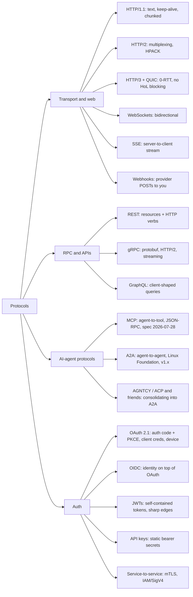

# Protocols

Software protocols an AI engineer actually touches: how bytes move (HTTP versions, sockets, streams), how services talk (REST, gRPC, GraphQL), how agents talk (MCP, A2A), and how everything authenticates. Updated 2026-08-24.

## Taxonomy

## Map of the space

- **Transport/web**: HTTP/1.1 -> 2 -> 3 is a series of head-of-line-blocking fixes (app layer, then transport layer via QUIC). Semantics (methods, status codes, caching, retries, idempotency) are version-independent and matter more day-to-day than the wire format. LLM APIs are long-lived streaming HTTP: SSE over POST, careful timeouts, idempotency keys. Details: [http.md](http.md).
- **Real-time and events**: client only receives -> SSE (this is LLM token streaming and MCP's HTTP transport). True bidirectional or binary (voice agents) -> WebSockets. Cross-service "job done" notifications -> webhooks, which means HMAC signature verification, at-least-once delivery, and idempotent consumers. Details: [realtime-and-events.md](realtime-and-events.md).
- **RPC/APIs**: REST (maturity level 2) for public APIs; gRPC (protobuf, four streaming modes, propagated deadlines, L7 load-balancing requirement) for internal and inference infra (Triton, Ray, vector DBs, OTLP); GraphQL for many-UI-client products, rarely for ML serving. Details: [rpc-and-apis.md](rpc-and-apis.md).
- **Agent protocols**: **MCP** connects one agent to tools/context (client-host-server, tools/resources/prompts, stdio + Streamable HTTP, OAuth 2.1). The 2026-07-28 revision made the core stateless and added extensions (Tasks, MCP Apps). **A2A** (Google-origin, Linux Foundation since June 2025, v1.x with 150+ member orgs) connects opaque agents to each other: Agent Cards for discovery, task lifecycle, JSON-RPC/HTTP+SSE; it complements MCP rather than competing (MCP = agent-to-tool, A2A = agent-to-agent). The rest of the 2025 alphabet soup consolidated: IBM's ACP merged into A2A; Cisco-led **AGNTCY** (agent directory, identity, its REST-flavored Agent Connect Protocol) moved under the Linux Foundation and its ACP SDK was archived in April 2026. Practical takeaway: build tool access on MCP, watch A2A for cross-org agent federation, ignore the rest unless a platform forces it. Deep dive (MCP): [mcp.md](mcp.md).
- **Auth**: OAuth 2.1 (still an IETF draft, but the operative standard): auth code + PKCE for anything user-facing, client credentials for M2M, device grant for headless. OIDC adds identity. JWTs are the token format with the long pitfall list (alg confusion, audience confusion, no revocation). Inside AWS prefer IAM/SigV4; across orgs, OIDC federation over long-lived secrets. MCP made every AI engineer an OAuth integrator, and banned token passthrough for good reasons. Details: [auth.md](auth.md).

## Which to reach for when

| Situation | Reach for |
|---|---|
| Public API for arbitrary clients | REST (L2) + SSE for streaming, [rpc-and-apis.md](rpc-and-apis.md) |
| Internal service-to-service, perf/streaming matters | gRPC, [rpc-and-apis.md](rpc-and-apis.md) |
| Stream LLM tokens to a client | SSE, [realtime-and-events.md](realtime-and-events.md) |
| Realtime voice / bidirectional agent channel | WebSockets, [realtime-and-events.md](realtime-and-events.md) |
| Notify across service boundaries when async work finishes | Webhooks (HMAC + idempotent consumer), [realtime-and-events.md](realtime-and-events.md) |
| Give an LLM app tools/context | MCP server, [mcp.md](mcp.md) |
| Federate agents across teams/vendors | A2A |
| User login | OIDC auth code + PKCE, [auth.md](auth.md) |
| Backend calls an LLM provider | API key in a secrets manager, [auth.md](auth.md) |
| AWS service calls AWS service | IAM/SigV4, [auth.md](auth.md) |

## Files

- [http.md](http.md): HTTP/1.1 vs 2 vs 3, QUIC, semantics, TLS, and HTTP for LLM APIs (streaming, timeouts, retries, idempotency).
- [mcp.md](mcp.md): MCP in depth: architecture, primitives, transports, OAuth, full spec history to 2026-07-28, security (prompt injection, confused deputy), ecosystem, building servers well.
- [realtime-and-events.md](realtime-and-events.md): WebSockets vs SSE vs webhooks vs long polling; webhook signatures/retries; SSE in LLM streaming and MCP.
- [rpc-and-apis.md](rpc-and-apis.md): REST maturity and API patterns (versioning, pagination, idempotency), gRPC mechanics, GraphQL, where each lives in ML serving.
- [auth.md](auth.md): OAuth 2.1 flows, OIDC, JWT pitfalls, API keys, mTLS/SigV4, and MCP-era auth (audience binding, no token passthrough).

## Best starting resources

- [High Performance Browser Networking](https://hpbn.co/) (free): transport fundamentals that make everything else legible.
- [MDN HTTP guide](https://developer.mozilla.org/en-US/docs/Web/HTTP): the reference you will actually open.
- [MCP specification](https://modelcontextprotocol.io/specification/latest) + [official blog](https://blog.modelcontextprotocol.io/): short, current, primary source.
- [A2A project](https://github.com/a2aproject/A2A): spec and Agent Card model for agent-to-agent.
- [OAuth 2.1 draft](https://oauth.net/2.1/) and [Aaron Parecki's OAuth guides](https://aaronparecki.com/oauth-2-simplified/): modern OAuth without the 2012-era baggage.
