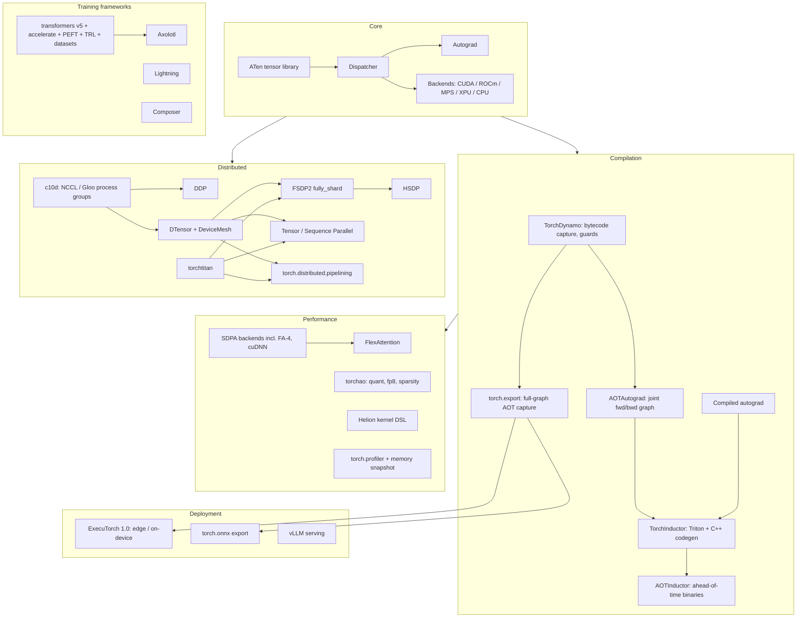

# Topic: pytorch-ecosystem

## Video

A narrated 7-minute explainer derived from this page. The page stays canonical: the video is a derived representation, and every figure it states comes from here.

[Topic: pytorch-ecosystem: two narrow interfaces, and everything else](https://prod-files-secure.s3.us-west-2.amazonaws.com/13e79c56-ebab-4528-83aa-967a204b1f04/74e196ca-e0a7-4b81-87a0-7c77707efe49/topic_pytorch_ecosystem_overview.mp4)

⏱ 7 min read · +2h 45m resources

Last verified: 2026-09-22. Current stable: **PyTorch 2.13.0** (July 2026).

Map of the stack, in the order a tensor meets it, because the diagram below is otherwise a wall of proper nouns.

**Core** is the eager runtime. **ATen** is the C++ tensor library every operator is implemented against. The **dispatcher** picks which implementation of an operator to call for a given device, dtype and autograd state, and is the extension point every backend, every custom op and every tensor subclass hooks into; understanding it is what makes torchao and DTensor stop looking like magic. **Autograd** is the tape that records those dispatched calls so backward can replay them.

**Compilation** replaces op-by-op interpretation with generated code in three stages: **TorchDynamo** captures Python bytecode into an FX graph plus guards, **AOTAutograd** builds one joint forward-backward graph, **TorchInductor** emits fused **Triton** or C++/OpenMP kernels. `torch.export` is the strict, full-graph variant of that capture step, and the one deployment builds on: **AOTInductor** turns an exported graph into a standalone shared library with no Python in the loop.

**Distributed** is built on **c10d**, the process-group layer over the NCCL and Gloo collective libraries, and on **DTensor**, a tensor carrying a device mesh plus a per-dimension placement. FSDP2, tensor parallel, pipelining and distributed checkpointing are all expressed in terms of DTensor, which is precisely why they compose with each other and with compile.

**Performance** is the attention and precision layer (SDPA backend selection, FlexAttention, torchao) plus the profiling tools. **Training frameworks** wrap all of the above into a loop you do not have to write. **Deployment** is where a trained model leaves the ecosystem: ExecuTorch for on-device, ONNX export for other vendors' runtimes, vLLM for serving.

Two of those pieces are load-bearing in a way the rest are not, and it is worth saying together what the paragraphs above say separately. **The dispatcher** and **DTensor** are this stack's two narrow interfaces: everything in Core hooks into the first, and everything in Distributed is expressed in the second, which is why the layers above them compose rather than collide. It is also a useful way to read the churn recorded below. The pieces other things are expressed **in** have been the stable ones; the pieces that merely wrap them are the ones that get deprecated or discontinued, which is the shape of FSDP1 giving way to `fully_shard`, and of torchtune and torchforge giving way to torchtitan.

### Version status

| Release | Date | Headlines |
| --- | --- | --- |
| 2.9 | Oct 2025 | **Symmetric memory**: tensors placed at the same virtual address on every GPU in an NVLink domain, so a kernel can read a peer's memory directly and custom fused collectives can beat NCCL on small messages. Python >= 3.10 floor; wheel variants (one wheel per accelerator build) |
| 2.10 | Jan 2026 | Python 3.14. `varlen_attn()`: attention over packed variable-length sequences addressed by a cumulative-length index instead of padding, the `flash_attn_varlen` equivalent in core. Inductor **combo-kernel fusion**: horizontally fusing many independent small kernels into one launch to cut launch overhead |
| 2.11 | Mar 2026 | **FSDP1 formally deprecated** in favour of the `fully_shard` API. **Differentiable collectives**: autograd now flows through explicit DTensor redistributions, so writing a manual all-gather or reduce-scatter no longer severs the backward pass. FlashAttention-4 SDPA backend on Hopper/Blackwell |
| 2.12 | May 2026 | `torch.accelerator.Graph`: capture a whole launch sequence once and replay it as a unit (the CUDA-graph idea, generalised across accelerator backends), removing per-kernel CPU launch cost for shape-stable workloads. Fused Adagrad; batched `linalg.eigh` |
| 2.13 | Jul 2026 | FlexAttention on Apple Silicon (MPS). **CuTeDSL Inductor backend**: Inductor can emit CUTLASS CuTe kernels as well as Triton, reaching Blackwell tensor-core features Triton does not expose. `nn.LinearCrossEntropyLoss` fuses the lm-head matmul into the loss so the [batch, seq, vocab] logits tensor is never materialised, usually the single largest activation in a large-vocab LLM. Python 3.15 |

Cadence is roughly one minor release per quarter.

### Governance and repo shuffle worth knowing

- The **PyTorch Foundation** is now a multi-project umbrella rather than the home of one library, and its six projects say where the ecosystem expects its centre of gravity to be: **PyTorch** itself; **vLLM**, the default open-source LLM serving engine; **DeepSpeed**, Microsoft's training library and the original implementation of ZeRO optimiser-state and parameter sharding, still the main alternative engine to FSDP2; **Ray**, the distributed-execution framework whose actor model underpins most RL rollout, batch-inference and hyperparameter stacks; **Helion**, the kernel DSL described below; and **Safetensors**, the zero-copy tensor container that replaced pickle checkpoints across the ecosystem.
- Meta's satellite libraries moved from the `pytorch/*` GitHub org to a separate `meta-pytorch` org, a rename that draws the line between community-governed projects and Meta-owned ones. The four that moved: **torchtitan**, the n-D-parallel pretraining reference; **torchtune**, fine-tuning recipes; **torchforge**, RL post-training; and **monarch**, an experiment in single-controller cluster programming, where one Python process drives the whole job as if it were a single machine instead of every rank re-executing the same script.
- Of those, **torchtune** is **discontinued** (mid-2025) and its intended RL successor **torchforge** is **paused**, with Meta consolidating LLM training into **torchtitan**: PyTorch-native training now means torchtitan plus the core APIs, and starting a project on torchtune or torchforge is starting on a dead branch. Details in [The layer above core: HF stack and training frameworks](hf-and-training-frameworks.md) (8 min read · +3h 50m resources).
- **Helion** is a high-level kernel DSL hosted by PyTorch: you write roughly a tiled loop nest in Python and the compiler autotunes the tiling, memory layout and pipelining that Triton makes you commit to by hand. It compiles to Triton, CuTeDSL and Pallas, so one source targets NVIDIA, AMD and TPU. It sits between `torch.compile`, which decides everything for you and occasionally decides badly, and hand-written Triton, which decides nothing for you. Prebuilt Helion kernels ship on the Hugging Face Kernels Hub, so you can pull one at runtime instead of compiling locally.
- **ExecuTorch** is on-device PyTorch: a `torch.export`ed graph lowered to a flatbuffer program plus per-backend delegate blobs, executed by a small C++ runtime with no Python and no dynamic dispatch. It hit **1.0** in Oct 2025: out of beta, multimodal on-device LLMs, torchao quantization integration, and Arm, Apple, Qualcomm and NVIDIA backends.

### Deep dives

| Page | What it covers |
| --- | --- |
| [torch.compile: Dynamo, AOTAutograd, Inductor](torch-compile.md) (9 min read · +3h 50m resources) | Dynamo capture (guards, graph breaks), AOTAutograd, Inductor/Triton codegen, modes, CUDA graphs, compiled autograd, regional compilation, TORCH_LOGS debugging |
| [Distributed PyTorch: DDP, FSDP2, DTensor, and friends](distributed-pytorch.md) (9 min read · +4h 5m resources) | DDP internals, FSDP1 vs FSDP2, DTensor and DeviceMesh, HSDP, TP/SP/PP/CP, torchrun/elastic, NCCL debugging |
| [PyTorch performance stack: attention, torchao, memory, profiling](performance-stack.md) (9 min read · +3h 5m resources) | SDPA backends, FlexAttention, torchao (quant/fp8/sparsity), memory snapshot, activation checkpointing, torch.profiler |
| [The layer above core: HF stack and training frameworks](hf-and-training-frameworks.md) (8 min read · +3h 50m resources) | transformers v5, accelerate, PEFT, TRL, datasets; torchtitan vs torchtune vs Axolotl vs Lightning; when to use which |

### Adjacent topics and papers

- Kernels and the Triton language itself: [Topic: cuda-and-gpu-programming](../cuda-and-gpu-programming/summary.md)
- Parallelism theory (ZeRO, TP/PP/EP math): [Topic: llm-training-and-post-training](../llm-training-and-post-training/summary.md)
- Serving (vLLM, SGLang): [Topic: inference-and-serving](../inference-and-serving/summary.md)
- Paper: [FlashAttention: Fast and Memory-Efficient Exact Attention with IO-Awareness](../../papers/2022-05_flashattention/summary.md) (2022) (45 min), the algorithm behind the SDPA flash backend and the mental model FlexAttention generalises.

### Best entry points into the whole ecosystem

- [PyTorch release blog index](https://pytorch.org/blog/) (blog index, ~20 min) and monthly
  [newsletter](https://pytorch.org/newsletter/august-2026/) (10 min): fastest way to track the 2.x line.

- [PyTorch dev-discuss](https://dev-discuss.pytorch.org/) (forum, ~30 min for the current front page): where compiler and distributed
  design discussions actually happen (RFCs, release announcements).

- [torchtitan repo](https://github.com/pytorch/torchtitan) (repo, ~1h for the entry path): the reference for composing
  FSDP2 + TP + PP + torch.compile in anger; effectively executable documentation.

- [Distributed PyTorch: DDP, FSDP2, DTensor, and friends](distributed-pytorch.md)
- [The layer above core: HF stack and training frameworks](hf-and-training-frameworks.md)
- [PyTorch performance stack: attention, torchao, memory, profiling](performance-stack.md)
- [torch.compile: Dynamo, AOTAutograd, Inductor](torch-compile.md)
