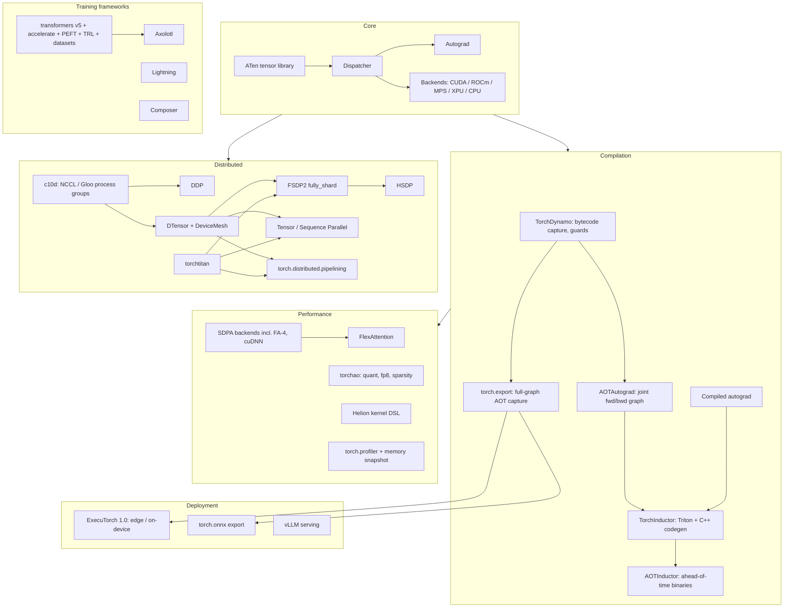

# PyTorch Ecosystem

Last verified: 2026-08-24. Current stable: **PyTorch 2.13.0** (July 2026).

Map of the stack: core runtime, compiler, distributed training, performance libraries,
the training-framework layer on top, and deployment paths.

## Version status (Aug 2026)

| Release | Date | Headlines |
|---|---|---|
| 2.9 | Oct 2025 | Symmetric memory (NVLink-domain tensors), Python >= 3.10 floor, wheel variants |
| 2.10 | Jan 2026 | Python 3.14, `varlen_attn()` for ragged sequences, Inductor combo-kernel fusion |
| 2.11 | Mar 2026 | **FSDP1 formally deprecated**, differentiable collectives, FlashAttention-4 SDPA backend on Hopper/Blackwell |
| 2.12 | May 2026 | `torch.accelerator.Graph` (device-neutral CUDA-graph API), fused Adagrad, batched `linalg.eigh` |
| 2.13 | Jul 2026 | FlexAttention on Apple Silicon (MPS), CuTeDSL Inductor backend, `nn.LinearCrossEntropyLoss` (fused, memory-saving), Python 3.15 |

Cadence is roughly one minor release per quarter.

## Governance and repo shuffle worth knowing

- The PyTorch Foundation is a multi-project umbrella hosting six projects: PyTorch,
  vLLM, DeepSpeed, Ray, Helion, and Safetensors.
- Meta-owned satellite libraries moved from `pytorch/*` to the `meta-pytorch` GitHub org
  (torchtitan, torchtune, torchforge, monarch).
- torchtune is **discontinued** (mid-2025); its successor torchforge (RL post-training)
  then also paused, with Meta consolidating LLM training into **torchtitan**.
  Details in [hf-and-training-frameworks.md](hf-and-training-frameworks.md).
- Helion: a PyTorch-hosted high-level kernel DSL (compiles to Triton, CuTeDSL, and
  Pallas backends; NVIDIA, AMD, and TPU targets). Sits between `torch.compile` and
  hand-written Triton; prebuilt kernels ship on the HF Kernels Hub.
- ExecuTorch hit 1.0 (Oct 2025): out of beta, multimodal on-device LLMs, torchao
  quantization integration, Arm/Apple/Qualcomm/NVIDIA backends.

## Deep dives in this folder

| File | What it covers |
|---|---|
| [torch-compile.md](torch-compile.md) | Dynamo capture (guards, graph breaks), AOTAutograd, Inductor/Triton codegen, modes, CUDA graphs, compiled autograd, regional compilation, TORCH_LOGS debugging |
| [distributed-pytorch.md](distributed-pytorch.md) | DDP internals, FSDP1 vs FSDP2, DTensor and DeviceMesh, HSDP, TP/SP/PP/CP, torchrun/elastic, NCCL debugging |
| [performance-stack.md](performance-stack.md) | SDPA backends, FlexAttention, torchao (quant/fp8/sparsity), memory snapshot, activation checkpointing, torch.profiler |
| [hf-and-training-frameworks.md](hf-and-training-frameworks.md) | transformers v5, accelerate, PEFT, TRL, datasets; torchtitan vs torchtune vs Axolotl vs Lightning; when to use which |

## Adjacent topics and papers

- Kernels and the Triton language itself: [../cuda-and-gpu-programming/](../cuda-and-gpu-programming/)
- Parallelism theory (ZeRO, TP/PP/EP math): [../llm-training-and-post-training/](../llm-training-and-post-training/)
- Serving (vLLM, SGLang): [../inference-and-serving/](../inference-and-serving/)
- Paper: [FlashAttention (2022)](../../papers/2022-05_flashattention/summary.md), the
  algorithm behind the SDPA flash backend and the mental model FlexAttention generalises.

## Best entry points into the whole ecosystem

- [PyTorch release blog index](https://pytorch.org/blog/) and monthly
  [newsletter](https://pytorch.org/newsletter/august-2026/): fastest way to track the 2.x line.
- [PyTorch dev-discuss](https://dev-discuss.pytorch.org/): where compiler and distributed
  design discussions actually happen (RFCs, release announcements).
- [torchtitan repo](https://github.com/pytorch/torchtitan): the reference for composing
  FSDP2 + TP + PP + torch.compile in anger; effectively executable documentation.
