# RAG and Retrieval

Last updated: 2026-08-24

Retrieval-augmented generation: everything between a user query and grounded, cited
LLM output. This page is the map; depth lives in the child files.

## Why RAG at all

A bare LLM has three problems that retrieval directly attacks:

1. **No source**: the model answers from parametric memory with nothing to cite.
2. **Out of date**: knowledge froze at the training cutoff; the world did not.
3. **Hallucination**: with no grounding text, the model fills gaps plausibly but wrongly.

RAG mitigates all three: answers are grounded in retrieved passages, the knowledge base
updates without retraining, and citations fall out for free. It is also the only
practical way to give a model private or per-tenant data. The 2026 twist: retrieval is
increasingly a *tool an agent calls* rather than a fixed pipeline; see
[advanced-and-agentic-rag.md](advanced-and-agentic-rag.md).

## The five components

Every RAG system, however fancy, decomposes into:

1. **Knowledge base**: the external data repository (documents, chunks, indexes).
2. **Retriever**: the model(s) plus index that search the knowledge base (dense, sparse, or hybrid).
3. **Ranker**: optional in theory, near-universal in production; reorders retrieved candidates by relevance (cross-encoder rerankers).
4. **Integration layer**: the orchestration coordinating query transformation, retrieval, filtering, and prompt assembly.
5. **Generator**: the LLM that produces the answer from query plus retrieved context (plus an output handler for formatting and citations).

## Taxonomy of the retrieval stack

```mermaid
graph TD
    RAG[RAG and retrieval]

    RAG --> EMB[Embeddings and vector search]
    EMB --> EM[Embedding models: Gemini Embedding, Qwen3-Embedding, Voyage 4, Cohere Embed v4, OpenAI te-3]
    EM --> MRL[Matryoshka dims, quantized vectors]
    EM --> LI[Late interaction: ColBERT, Jina-ColBERT]
    EMB --> ANN[ANN indexes: HNSW, IVF, PQ/ScaNN, DiskANN]
    EMB --> VDB[Vector DBs: pgvector, Qdrant, Milvus, Weaviate, Pinecone, LanceDB, Turbopuffer]

    RAG --> PIPE[Retrieval pipeline]
    PIPE --> CHUNK[Chunking: fixed, semantic, late chunking, contextual retrieval]
    PIPE --> HYB[Hybrid search: BM25 + dense, RRF fusion]
    PIPE --> QT[Query transformation: HyDE, multi-query, decomposition]
    PIPE --> RR[Rerankers: Cohere Rerank 4, Qwen3-Reranker, BGE, Jina]
    PIPE --> META[Metadata filtering]

    RAG --> GEN[Generation patterns]
    GEN --> NAIVE[Naive RAG: retrieve then stuff prompt]
    GEN --> ADV[Advanced RAG: pre/post-retrieval stages, routing]
    GEN --> AGENTIC[Agentic RAG: retrieval as a tool in a loop]
    AGENTIC --> GRAPH[GraphRAG: Microsoft GraphRAG, LazyGraphRAG, LightRAG]
    AGENTIC --> DEEP[Deep-research patterns, memory systems]
    AGENTIC --> LC[Long-context vs RAG tradeoff]

    RAG --> EVAL[Evaluation]
    EVAL --> RMET[Retrieval metrics: recall@k, nDCG, MRR]
    EVAL --> GMET[Faithfulness, answer relevance, context precision/recall]
    EVAL --> TOOLS[RAGAS, DeepEval, TruLens, ARES; golden sets, failure analysis]
```

## Map of the space (skim this)

- **Embedding + index layer**: pick an embedding model (MTEB is the scoreboard;
  benchmark on your own corpus), an ANN index (HNSW is the default), and a store
  (Postgres + pgvector is enough more often than vendors admit).
  Deep dive: [embeddings-and-vector-search.md](embeddings-and-vector-search.md)
- **Pipeline layer**: chunking decisions move quality more than model choice; hybrid
  BM25 + dense with RRF fusion plus a cross-encoder reranker is the 2026 production
  default; contextual retrieval is the quality ceiling for static pipelines.
  Deep dive: [retrieval-pipeline.md](retrieval-pipeline.md)
- **Architecture layer**: naive -> advanced -> agentic is the maturity ladder.
  GraphRAG (prefer LazyGraphRAG or LightRAG) for corpus-global questions; agentic
  loops for multi-hop; long context absorbs the small-corpus end of RAG's old
  territory. Deep dive: [advanced-and-agentic-rag.md](advanced-and-agentic-rag.md)
- **Evaluation layer**: recall@k and nDCG for the retriever, LLM-judged faithfulness
  and relevance for the generator, golden sets and recall-first failure triage to make
  it trustworthy. Deep dive: [rag-evaluation.md](rag-evaluation.md)

## Papers

- [RAG (Lewis et al., 2020)](../../papers/2020-05_rag/summary.md): the original
  retrieval-augmented generation paper; retriever plus generator, trained end to end.
- [ReAct (2022)](../../papers/2022-10_react/summary.md): reason-act loops, the
  conceptual ancestor of agentic retrieval.

## Related topics

- [Evaluation and LLM judges](../evaluation-and-llm-judges/summary.md): judge design
  behind RAGAS-style metrics.
- [Agentic frameworks](../agentic-frameworks/summary.md): LangGraph and LlamaIndex are
  the usual integration layers.
