# RAG and Retrieval

⏱ 9 min read · +1h 30m resources

Last updated: 2026-08-24

Retrieval-augmented generation: everything between a user query and grounded, cited
LLM output. This page is the map; depth lives in the child files.

## Why RAG at all

A bare LLM has three problems that retrieval directly attacks:

1. **No source**: the model answers from parametric memory with nothing to cite.
2. **Out of date**: knowledge froze at the training cutoff; the world did not.
3. **Hallucination**: with no grounding text, the model fills gaps plausibly but wrongly.

RAG mitigates all three: answers are grounded in retrieved passages, the knowledge base
updates without retraining, and citations fall out for free. It is also the only
practical way to give a model private or per-tenant data. The 2026 twist: retrieval is
increasingly a *tool an agent calls* rather than a fixed pipeline; see
[advanced-and-agentic-rag.md](advanced-and-agentic-rag.md).

## The five components

Every RAG system, however fancy, decomposes into:

1. **Knowledge base**: the external data repository (documents, chunks, indexes).
2. **Retriever**: the model(s) plus index that search the knowledge base (dense, sparse, or hybrid).
3. **Ranker**: optional in theory, near-universal in production; reorders retrieved candidates by relevance (cross-encoder rerankers).
4. **Integration layer**: the orchestration coordinating query transformation, retrieval, filtering, and prompt assembly.
5. **Generator**: the LLM that produces the answer from query plus retrieved context (plus an output handler for formatting and citations).

## Taxonomy of the retrieval stack

```mermaid
graph TD
    RAG[RAG and retrieval]

    RAG --> EMB[Embeddings and vector search]
    EMB --> EM[Embedding models: Gemini Embedding, Qwen3-Embedding, Voyage 4, Cohere Embed v4, OpenAI te-3]
    EM --> MRL[Matryoshka dims, quantized vectors]
    EM --> LI[Late interaction: ColBERT, Jina-ColBERT]
    EMB --> ANN[ANN indexes: HNSW, IVF, PQ/ScaNN, DiskANN]
    EMB --> VDB[Vector DBs: pgvector, Qdrant, Milvus, Weaviate, Pinecone, LanceDB, Turbopuffer]

    RAG --> PIPE[Retrieval pipeline]
    PIPE --> CHUNK[Chunking: fixed, semantic, late chunking, contextual retrieval]
    PIPE --> HYB[Hybrid search: BM25 + dense, RRF fusion]
    PIPE --> QT[Query transformation: HyDE, multi-query, decomposition]
    PIPE --> RR[Rerankers: Cohere Rerank 4, Qwen3-Reranker, BGE, Jina]
    PIPE --> META[Metadata filtering]

    RAG --> GEN[Generation patterns]
    GEN --> NAIVE[Naive RAG: retrieve then stuff prompt]
    GEN --> ADV[Advanced RAG: pre/post-retrieval stages, routing]
    GEN --> AGENTIC[Agentic RAG: retrieval as a tool in a loop]
    AGENTIC --> GRAPH[GraphRAG: Microsoft GraphRAG, LazyGraphRAG, LightRAG]
    AGENTIC --> DEEP[Deep-research patterns, memory systems]
    AGENTIC --> LC[Long-context vs RAG tradeoff]

    RAG --> EVAL[Evaluation]
    EVAL --> RMET[Retrieval metrics: recall@k, nDCG, MRR]
    EVAL --> GMET[Faithfulness, answer relevance, context precision/recall]
    EVAL --> TOOLS[RAGAS, DeepEval, TruLens, ARES; golden sets, failure analysis]
```

Diagram source (mermaid)

## Map of the space (skim this)

- **Embedding + index layer**: three choices, which model, which index, which store. **MTEB (Massive Text Embedding Benchmark)** is the public scoreboard, a suite of retrieval, clustering and classification tasks that embedding models are ranked on; treat a high row as a prior rather than a verdict, because models are tuned against it and a legal, code or log corpus reorders the table. The index is an **ANN (approximate nearest neighbour)** structure, which gives up exactness in the k-nearest-neighbour search to avoid scanning every vector. **HNSW (Hierarchical Navigable Small World)** is the default: a multi-layer proximity graph where search greedily descends from a sparse top layer to the dense bottom one, giving high recall at low latency in exchange for keeping the whole graph resident in RAM and a slow build. For the store, Postgres with the **pgvector** extension (vector columns plus ANN indexes inside an ordinary relational database) is enough more often than vendors admit, because it keeps chunks, metadata and vectors in one transactional system with real SQL filtering.
  Deep dive: [embeddings-and-vector-search.md](embeddings-and-vector-search.md) (7 min read · +2h 30m resources)
- **Pipeline layer**: chunking (how a document is cut into retrievable units) moves quality more than embedding-model choice, because a chunk that has lost its document context cannot be matched by a query that assumes that context. The 2026 production default is hybrid search. **BM25 (Best Match 25)** is the classic lexical ranking function: term frequency, damped so repetition saturates, weighted by inverse document frequency and normalised by document length. It nails exact identifiers, error codes and rare names, which dense vectors miss; dense vectors catch paraphrase, which BM25 misses. Their score scales are incomparable (BM25 is unbounded, cosine is bounded), so the two result lists are combined by **RRF (Reciprocal Rank Fusion)**, which discards scores entirely and sums 1/(k + rank) over lists, k=60 by convention. A **cross-encoder reranker** then reads query and candidate document jointly in one forward pass, rather than embedding them independently, and reorders the top 50-150; it buys precision for 30-300 ms and is the highest-leverage single addition to a stack. **Contextual retrieval** (Anthropic) is the quality ceiling for static pipelines: at index time an LLM sees the whole document plus the chunk and writes a 50-100 token situating prefix, which is prepended before both embedding and BM25 indexing, cutting top-20 retrieval failures by roughly half.
  Deep dive: [retrieval-pipeline.md](retrieval-pipeline.md) (7 min read · +1h 44m resources)
- **Architecture layer**: naive -> advanced -> agentic is the maturity ladder.
  It is a ladder of who decides what to retrieve: naive RAG retrieves once with the raw query, advanced RAG wraps that in a fixed graph of query rewriting, filtering and reranking, and agentic RAG hands retrieval to the model as a tool it may call repeatedly, writing its own queries until it judges the context sufficient. **GraphRAG** (Microsoft) exists for the questions vector search cannot answer at all, the corpus-global ones ("what are the main themes across these 10K documents"), where no single chunk contains the answer: an LLM extracts entities and relations into a knowledge graph, Leiden community detection clusters it, and an LLM summarises the communities hierarchically, so a global query becomes a map-reduce over summaries. It works and it is expensive, four figures of indexing on a 10K-document corpus and a re-index on updates. Prefer **LazyGraphRAG**, which builds only a cheap non-LLM concept graph at index time and defers all summarisation to query time over the relevant subgraph, matching full GraphRAG on global search at roughly 700x lower query cost, or **LightRAG**, a stripped-down open implementation with flat entity extraction and dual graph-plus-vector retrieval that reaches 70-90% of the quality at about 1/100 the indexing cost. Agentic loops earn their 3-10x latency and token cost on multi-hop and exploratory questions and waste it on factoid lookups, which is why routers exist. Long context (million-token windows) absorbs the small-corpus end of RAG's old territory, where building an index is pure overhead.
  Deep dive: [advanced-and-agentic-rag.md](advanced-and-agentic-rag.md) (7 min read · +3h resources)
- **Evaluation layer**: split the system and measure each half. For the retriever, **recall@k** is the fraction of labelled relevant chunks that appear in the top k, and it dominates because nothing downstream can recover an answer that never entered the prompt. **nDCG@k (normalised discounted cumulative gain)** is the rank-weighted metric that handles graded relevance and discounts hits further down the list; it is the standard for comparing rerankers, whose entire job is moving items up. For the generator, both headline metrics are computed by prompting a judge LLM: **faithfulness** decomposes the answer into atomic claims and measures the fraction entailed by the retrieved context (low faithfulness means hallucination despite retrieval), and **answer relevance** checks that the answer addresses the question at all. Make the numbers trustworthy with a golden set of a few hundred human-labelled queries, and triage recall-first: for every wrong answer, check whether the gold chunk was in the prompt, a single bit that assigns the bug to the retrieval half or the generation half.
  Deep dive: [rag-evaluation.md](rag-evaluation.md) (6 min read · +1h 27m resources)

## Papers

- **RAG (Lewis et al., 2020)** (45 min): the paper that named the pattern. A dense passage retriever picks documents from a Wikipedia index and a seq2seq generator conditions on them, with the retriever trained against the generation loss so it learns to fetch what the generator can actually use. Production systems kept the architecture and dropped the joint training, which is why "RAG" now means the wiring rather than the method.
- **ReAct (2022)** (45 min): interleaves reasoning traces with tool actions in one decoding loop (thought, action, observation, repeat) instead of planning first and acting later. That loop is the conceptual ancestor of agentic retrieval: search becomes an action the model chooses, whose result it reads and reacts to, rather than a fixed step that happens before generation.

## Related topics

- **Evaluation and LLM judges**: **RAGAS (Retrieval-Augmented Generation Assessment)** is the library that popularised the faithfulness / answer-relevance / context-precision triad, and every one of those numbers is produced by prompting a judge model. Judge design, position and leniency bias, and calibration against hand labels therefore decide whether the metrics mean anything; all of it transfers directly from that topic.
- **Agentic frameworks**: **LangGraph** models an agent as an explicit state machine of nodes and edges over a shared state object, which makes loops, branching and checkpointed resumption first-class instead of emergent. **LlamaIndex** is the data-side counterpart: ingestion connectors, index abstractions over documents, and query engines that compose retrieval, routing and synthesis. Both are the usual place the integration layer of a RAG system actually lives.
