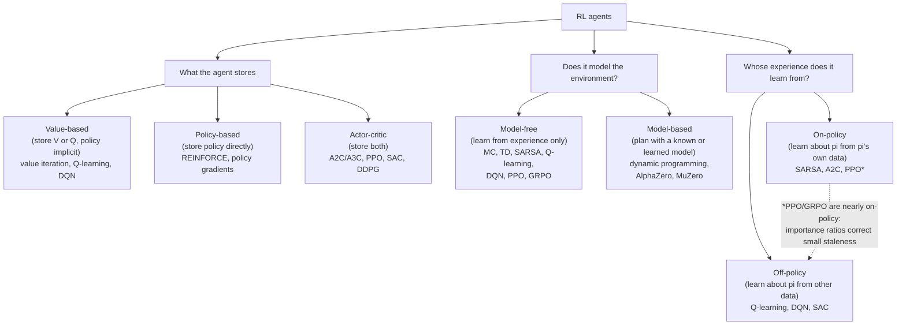

# Topic: rl

## Video

A narrated 7-minute explainer derived from this page. The page stays canonical: the video is a derived representation, and every figure it states comes from here.

[Topic: rl: one line from Bellman to verifiers](https://prod-files-secure.s3.us-west-2.amazonaws.com/13e79c56-ebab-4528-83aa-967a204b1f04/d76d2cc7-92c2-41f7-a472-708027cca5a6/topic_rl_overview.mp4)

⏱ 6 min read · +38h resources

RL is the branch of ML where an agent learns behaviour by interacting with an environment and

maximising cumulative reward. This topic runs from the classical core (MDPs, Bellman equations,

dynamic programming, Monte Carlo and TD) through deep RL (DQN, policy gradients, PPO, AlphaZero)

to the current frontier: RL as the engine of LLM post-training (RLHF, GRPO, RLVR).

### Taxonomy

Three orthogonal axes; every agent sits somewhere on each. Examples: DQN is value-based,

model-free, off-policy. PPO is actor-critic, model-free, approximately on-policy. AlphaZero is

model-based with policy and value networks.

### Map of the space

**The classical core.** An **MDP (Markov Decision Process)** is the formal object all of RL optimises over: states, actions, a transition distribution, a reward function, a discount factor, with the Markov property (the future depends on the current state alone) making one-step recursion valid. The **Bellman equations** are that recursion, the value of a state being the immediate reward plus the discounted value of its successor, which converts an infinite-horizon problem into a fixed-point problem. Every algorithm below solves one of them approximately; the full vocabulary is on [RL foundations](foundations.md).

**Dynamic programming** solves those equations exactly when the transition model is known: **policy iteration** alternates evaluating the current policy with making it greedy on those values, **value iteration** skips the explicit policy and backs up the best action at every state directly. Both need the full model and a small state space, so they are the ideal everything else approximates by sampling: [Dynamic programming: planning with a known model](dynamic-programming.md).

**Monte Carlo** drops the model and averages the actual returns of complete episodes: unbiased, but a whole episode's randomness lands in every estimate, so variance is high and you must wait for termination. **TD (temporal-difference) learning** updates from its own one-step-ahead estimate instead, trading bias for lower variance and working online on non-terminating tasks; **TD(lambda)** is the dial between the two. **SARSA** bootstraps off the action actually taken next, so it learns the value of the exploratory policy it is running (on-policy); **Q-learning** bootstraps off the best next action, learning the greedy policy while behaving exploratorily (off-policy), which is exactly what makes replaying old experience legitimate. [Model-free methods: Monte Carlo, TD, SARSA, Q-learning](model-free-methods.md).

**Deep RL** replaces tables with networks, and is largely a list of stabilisation tricks. **DQN** buys stability with an experience replay buffer (breaking the temporal correlation of consecutive transitions) and a frozen target network (so the regression target stops moving while you chase it). **Policy gradients** optimise the policy directly: raise the log-probability of an action in proportion to how good it turned out, which **REINFORCE** does with the sampled return, unbiased but very high variance. Subtracting a state-dependent baseline leaves the gradient unbiased while cutting variance, and the natural baseline V(s) turns the return into an **advantage**; learning that baseline with a critic is what makes a method **actor-critic** (**A3C** asynchronous across parallel workers, **A2C** its synchronous batched version, which is structurally what modern LLM RL loops are). **TRPO** made "take the largest step that is still safe" precise with a KL constraint at the cost of second-order machinery; **PPO** gets the same effect first-order by clipping the importance ratio so the objective goes flat once you have moved far enough in the direction the advantage wants, which is what makes several epochs of minibatch SGD on one rollout batch safe. **SAC** adds an entropy bonus so exploration does not collapse, the off-policy default for continuous control. The model-based line is **AlphaZero**, where MCTS over the game's known rules is the policy-improvement operator and its improved move distribution becomes the training target, and **MuZero**, which drops the requirement for known rules by learning a latent dynamics model end to end and planning inside it. [Deep RL: from DQN to PPO to MuZero](deep-rl.md).

**RL for LLMs.** Token generation is an MDP with a deterministic transition (append the token), a vocabulary-sized action space and a single reward at the end, so credit assignment over thousands of tokens is the hard part and the environment model is trivial. **RLHF** (reinforcement learning from human feedback: a reward model plus PPO with a per-token KL penalty to a frozen reference), **GRPO** (group relative policy optimisation: the value model deleted, a sampled group's mean reward as the baseline), **RLVR** (reinforcement learning from verifiable rewards: a programmatic verifier in place of the learned reward model), DeepSeek-R1, and the 2025-2026 corrections to GRPO's known biases (Dr. GRPO, DAPO, GSPO, off-policy corrections) are all on [RL for LLMs: RLHF, GRPO, RLVR](rl-for-llms-rlhf-grpo-rlvr.md); the alignment pipeline around them, SFT, reward-model training and the DPO family, is on [Alignment: SFT, RLHF, DPO Family, RLVR](../llm-training-and-post-training/alignment-and-rlhf.md). For a worked recipe at frontier scale, Mercor with SkyRL trained Qwen3.5-397B-A17B on 1,928 expert knowledge-work tasks and reports a 70% relative improvement in APEX-Agents Pass@1, with the argument that exact token accounting, asynchronous RL, environment robustness and harness design decide the outcome as much as the algorithm does; it sits in full on [Topic: llm-training-and-post-training](../llm-training-and-post-training/summary.md). [Mercor](https://www.mercor.com/blog/training-frontier-knowledge-work-agents-a-397b-rl-training-guide-with-skyrl/) (25 min)

### Map of the deep dives

| Page | What it covers |
| --- | --- |
| [RL foundations](foundations.md) | The vocabulary and math skeleton: agent taxonomy, exploration vs exploitation, prediction vs control, bootstrapping vs sampling, on/off-policy, reward hypothesis, history/state/observability, policy/value/model, V and Q, Markov process to MRP to MDP, discounting, Bellman equations |
| [Dynamic programming: planning with a known model](dynamic-programming.md) | Planning with a known model: policy evaluation, policy iteration, value iteration, and how they compare |
| [Model-free methods: Monte Carlo, TD, SARSA, Q-learning](model-free-methods.md) | Learning without a model: Monte Carlo evaluation, TD learning, TD(lambda) and its relation to MC, epsilon-greedy and GLIE, SARSA, Q-learning |
| [Deep RL: from DQN to PPO to MuZero](deep-rl.md) | Function approximation era: DQN and variants (double, dueling, Rainbow), REINFORCE and baselines, actor-critic (A2C/A3C), TRPO to PPO and the clipped objective, SAC/DDPG, AlphaGo to MuZero |
| [RL for LLMs: RLHF, GRPO, RLVR](rl-for-llms-rlhf-grpo-rlvr.md) | The bridge to LLM post-training: token generation as an MDP, PPO-for-RLHF mechanics, GRPO in detail, RLVR, DeepSeek-R1, and the 2025-2026 debates (Dr. GRPO, DAPO, GSPO, off-policy corrections) |

### Suggested reading order

1. [RL foundations](foundations.md): everything else reuses its vocabulary.
2. [Dynamic programming: planning with a known model](dynamic-programming.md), then [Model-free methods: Monte Carlo, TD, SARSA, Q-learning](model-free-methods.md): the two classical solution families.
3. [Deep RL: from DQN to PPO to MuZero](deep-rl.md): how neural networks replaced tables, and why PPO exists.
4. [RL for LLMs: RLHF, GRPO, RLVR](rl-for-llms-rlhf-grpo-rlvr.md): the payoff for the RLVR/GRPO training-loop project.

### Related papers

- [Training language models to follow instructions with human feedback (InstructGPT)](../../papers/2022-03_instructgpt/summary.md) (2022-03): the canonical RLHF-with-PPO recipe.
- [DeepSeekMath: Pushing the Limits of Mathematical Reasoning in Open Language Models](../../papers/2024-02_deepseekmath-grpo/summary.md) (2024-02): introduces GRPO.
- [DeepSeek-R1: Incentivizing Reasoning Capability in LLMs via Reinforcement Learning](../../papers/2025-01_deepseek-r1/summary.md) (2025-01): large-scale RLVR and the R1-Zero result.

### Related topics

- [Alignment: SFT, RLHF, DPO Family, RLVR](../llm-training-and-post-training/alignment-and-rlhf.md): the full alignment pipeline (SFT, reward models, DPO family) around the RL algorithms covered here.
- [Reward Hacking](../llm-training-and-post-training/reward-hacking.md): what goes wrong when the reward is a proxy.

### Best resources for the topic as a whole

- David Silver's UCL course (10 lectures): [https://www.davidsilver.uk/teaching/](https://www.davidsilver.uk/teaching/) (~15h): still the best structured path through classical RL.
- Sutton & Barto, *Reinforcement Learning: An Introduction* (2nd ed., free PDF): [http://incompleteideas.net/book/the-book-2nd.html](http://incompleteideas.net/book/the-book-2nd.html) (~14h): the reference text.
- OpenAI Spinning Up: [https://spinningup.openai.com](https://spinningup.openai.com/) (docs, ~3h for the core pages): the best practical bridge from theory to deep RL code.
- Nathan Lambert, *RLHF Book*: [https://rlhfbook.com](https://rlhfbook.com/) (~6h): the reference for the LLM side.
- [Deep RL: from DQN to PPO to MuZero](deep-rl.md)
- [Dynamic programming: planning with a known model](dynamic-programming.md)
- [RL foundations](foundations.md)
- [Model-free methods: Monte Carlo, TD, SARSA, Q-learning](model-free-methods.md)
- [RL for LLMs: RLHF, GRPO, RLVR](rl-for-llms-rlhf-grpo-rlvr.md)
