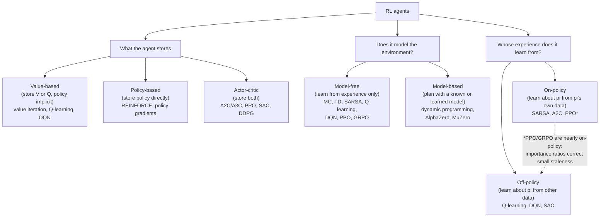

# Reinforcement Learning

RL is the branch of ML where an agent learns behaviour by interacting with an environment and
maximising cumulative reward. This topic runs from the classical core (MDPs, Bellman equations,
dynamic programming, Monte Carlo and TD) through deep RL (DQN, policy gradients, PPO, AlphaZero)
to the current frontier: RL as the engine of LLM post-training (RLHF, GRPO, RLVR).

## Taxonomy

Three orthogonal axes; every agent sits somewhere on each. Examples: DQN is value-based,
model-free, off-policy. PPO is actor-critic, model-free, approximately on-policy. AlphaZero is
model-based with policy and value networks.

## Map of the files

| File | What it covers |
|---|---|
| [foundations.md](foundations.md) | The vocabulary and math skeleton: agent taxonomy, exploration vs exploitation, prediction vs control, bootstrapping vs sampling, on/off-policy, reward hypothesis, history/state/observability, policy/value/model, V and Q, Markov process to MRP to MDP, discounting, Bellman equations |
| [dynamic-programming.md](dynamic-programming.md) | Planning with a known model: policy evaluation, policy iteration, value iteration, and how they compare |
| [model-free-methods.md](model-free-methods.md) | Learning without a model: Monte Carlo evaluation, TD learning, TD(lambda) and its relation to MC, epsilon-greedy and GLIE, SARSA, Q-learning |
| [deep-rl.md](deep-rl.md) | Function approximation era: DQN and variants (double, dueling, Rainbow), REINFORCE and baselines, actor-critic (A2C/A3C), TRPO to PPO and the clipped objective, SAC/DDPG, AlphaGo to MuZero |
| [rl-for-llms.md](rl-for-llms.md) | The bridge to LLM post-training: token generation as an MDP, PPO-for-RLHF mechanics, GRPO in detail, RLVR, DeepSeek-R1, and the 2025-2026 debates (Dr. GRPO, DAPO, GSPO, off-policy corrections) |

## Suggested reading order

1. `foundations.md`: everything else reuses its vocabulary.
2. `dynamic-programming.md`, then `model-free-methods.md`: the two classical solution families.
3. `deep-rl.md`: how neural networks replaced tables, and why PPO exists.
4. `rl-for-llms.md`: the payoff for the RLVR/GRPO training-loop project.

## Related papers (central papers/)

- [InstructGPT (2022-03)](../../papers/2022-03_instructgpt/summary.md): the canonical RLHF-with-PPO recipe.
- [DeepSeekMath / GRPO (2024-02)](../../papers/2024-02_deepseekmath-grpo/summary.md): introduces GRPO.
- [DeepSeek-R1 (2025-01)](../../papers/2025-01_deepseek-r1/summary.md): large-scale RLVR and the R1-Zero result.

## Related topics

- [alignment-and-rlhf](../llm-training-and-post-training/alignment-and-rlhf.md): the full alignment pipeline (SFT, reward models, DPO family) around the RL algorithms covered here.
- [reward-hacking](../llm-training-and-post-training/reward-hacking.md): what goes wrong when the reward is a proxy.

## Best resources for the topic as a whole

- David Silver's UCL course (10 lectures): https://www.davidsilver.uk/teaching/ ; still the best structured path through classical RL.
- Sutton & Barto, *Reinforcement Learning: An Introduction* (2nd ed., free PDF): http://incompleteideas.net/book/the-book-2nd.html ; the reference text.
- OpenAI Spinning Up: https://spinningup.openai.com ; the best practical bridge from theory to deep RL code.
- Nathan Lambert, *RLHF Book*: https://rlhfbook.com ; the reference for the LLM side.
