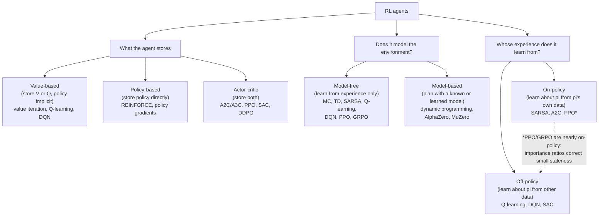

# Reinforcement Learning

⏱ 7 min read · +38h resources

RL is the branch of ML where an agent learns behaviour by interacting with an environment and
maximising cumulative reward. This topic runs from the classical core (MDPs, Bellman equations,
dynamic programming, Monte Carlo and TD) through deep RL (DQN, policy gradients, PPO, AlphaZero)
to the current frontier: RL as the engine of LLM post-training (RLHF, GRPO, RLVR).

## Taxonomy

Diagram source (mermaid)

Three orthogonal axes; every agent sits somewhere on each. Examples: DQN is value-based,
model-free, off-policy. PPO is actor-critic, model-free, approximately on-policy. AlphaZero is
model-based with policy and value networks.

## Map of the space

**The classical core.** An **MDP (Markov Decision Process)** is the formal object all of RL optimises over: states, actions, a transition distribution, a reward function, and a discount factor, with the Markov property (the future depends on the current state alone) making one-step recursion valid. The **Bellman equations** are that recursion: the value of a state is the immediate reward plus the discounted value of its successor, which converts an infinite-horizon problem into a fixed-point problem. Every algorithm below is a way of solving one of them approximately.

**Dynamic programming** solves the Bellman equations exactly when the transition model is known. **Policy iteration** alternates evaluating the current policy with making it greedy on those values; **value iteration** skips the explicit policy and backs up the best action at every state directly. Both need the full model and a small state space, so they are the ideal that everything else approximates by sampling.

**Monte Carlo** methods drop the model and estimate a state's value by averaging the actual returns of complete episodes: unbiased, but a whole episode's randomness lands in every estimate, so variance is high and you must wait for termination. **TD (temporal-difference) learning** updates from its own one-step-ahead estimate instead of the realised return, which introduces bias but cuts variance and works online on non-terminating tasks; **TD(lambda)** is the dial between the two extremes. **SARSA** is TD control that bootstraps off the action actually taken next, so it learns the value of the exploratory policy it is running (on-policy). **Q-learning** bootstraps off the best next action instead, so it learns the greedy policy while behaving exploratorily (off-policy), which is exactly what makes replaying old experience legitimate.

**Deep RL.** **DQN (Deep Q-Network)** replaces the Q-table with a convolutional network and buys stability with two tricks: an experience replay buffer that breaks the temporal correlation of consecutive transitions, and a frozen target network so the regression target stops moving while you chase it. **Policy gradients** optimise the policy directly rather than deriving it from values; the policy gradient theorem says to raise the log-probability of an action in proportion to how good it turned out, and **REINFORCE** does that with the sampled return, unbiased but very high variance. Subtracting a state-dependent baseline leaves the gradient unbiased while cutting variance, and the natural baseline V(s) turns the return into an **advantage** (how much better than average this action was); learning that baseline with a critic is what makes a method **actor-critic** (**A3C** asynchronous across parallel workers, **A2C** its synchronous batched version, which is structurally what modern LLM RL loops are). **TRPO (Trust Region Policy Optimization)** made "take the largest step that is still safe" precise with a KL constraint, at the cost of second-order machinery. **PPO (Proximal Policy Optimization)** gets the same effect first-order by clipping the importance ratio between new and old policy so the objective goes flat once you have moved far enough in the direction the advantage wants, which is what makes several epochs of minibatch SGD on one rollout batch safe. **SAC (Soft Actor-Critic)** adds an entropy bonus to the objective so exploration does not collapse, the off-policy default for continuous control. **AlphaZero** is the model-based line: MCTS (Monte Carlo tree search) over the game's known rules acts as a policy-improvement operator and its improved move distribution becomes the training target, so search and learning bootstrap each other. **MuZero** removes the requirement for known rules by learning a latent dynamics model end to end and planning inside it.

**RL for LLMs.** Token generation is an MDP with a deterministic transition (append the token), a vocabulary-sized action space, and a single reward at the end, so credit assignment over thousands of tokens is the hard part and the environment model is trivial. **RLHF (RL from Human Feedback)** trains a reward model on human preference pairs and optimises the policy against it with PPO, subtracting a per-token KL penalty against a frozen reference model, which both anchors the trust region and keeps the policy in the region where the reward model is still trustworthy. **GRPO (Group Relative Policy Optimization)** deletes the value model: it samples a group of responses per prompt and uses the group's mean reward as the baseline, so the critic's memory cost and its per-token estimation problem both disappear, paid for with G rollouts per prompt and uniform credit across every token of a response. **RLVR (RL with Verifiable Rewards)** replaces the learned reward model with a programmatic verifier (exact-match answers, unit tests, task-success checks), which removes the reward model's exploitable bias and scales with compute wherever a verifier exists. The 2025-2026 refinements are all corrections to GRPO's known biases: **Dr. GRPO** drops the length and standard-deviation normalisations that respectively reward long wrong answers and over-weight low-variance prompts; **DAPO** adds asymmetric "clip-higher" clipping against entropy collapse plus dynamic resampling past groups whose rewards are all identical and therefore give zero gradient; **GSPO** moves the importance ratio from token level to sequence level, which stabilises long sequences and MoE training.

## Map of the files

| File | What it covers |
|---|---|
| [foundations.md](foundations.md) | The vocabulary and math skeleton: agent taxonomy, exploration vs exploitation, prediction vs control, bootstrapping vs sampling, on/off-policy, reward hypothesis, history/state/observability, policy/value/model, V and Q, Markov process to MRP to MDP, discounting, Bellman equations |
| [dynamic-programming.md](dynamic-programming.md) | Planning with a known model: policy evaluation, policy iteration, value iteration, and how they compare |
| [model-free-methods.md](model-free-methods.md) | Learning without a model: Monte Carlo evaluation, TD learning, TD(lambda) and its relation to MC, epsilon-greedy and GLIE, SARSA, Q-learning |
| [deep-rl.md](deep-rl.md) | Function approximation era: DQN and variants (double, dueling, Rainbow), REINFORCE and baselines, actor-critic (A2C/A3C), TRPO to PPO and the clipped objective, SAC/DDPG, AlphaGo to MuZero |
| [rl-for-llms.md](rl-for-llms.md) | The bridge to LLM post-training: token generation as an MDP, PPO-for-RLHF mechanics, GRPO in detail, RLVR, DeepSeek-R1, and the 2025-2026 debates (Dr. GRPO, DAPO, GSPO, off-policy corrections) |

## Suggested reading order

1. `foundations.md`: everything else reuses its vocabulary.
2. `dynamic-programming.md`, then `model-free-methods.md`: the two classical solution families.
3. `deep-rl.md`: how neural networks replaced tables, and why PPO exists.
4. `rl-for-llms.md`: the payoff for the RLVR/GRPO training-loop project.

## Related papers (central papers/)

- [InstructGPT (2022-03)](../../papers/2022-03_instructgpt/summary.md): the canonical RLHF-with-PPO recipe.
- [DeepSeekMath / GRPO (2024-02)](../../papers/2024-02_deepseekmath-grpo/summary.md): introduces GRPO.
- [DeepSeek-R1 (2025-01)](../../papers/2025-01_deepseek-r1/summary.md): large-scale RLVR and the R1-Zero result.

## Related topics

- [alignment-and-rlhf](../llm-training-and-post-training/alignment-and-rlhf.md): the full alignment pipeline (SFT, reward models, DPO family) around the RL algorithms covered here.
- [reward-hacking](../llm-training-and-post-training/reward-hacking.md): what goes wrong when the reward is a proxy.

## Best resources for the topic as a whole

- David Silver's UCL course (10 lectures): [https://www.davidsilver.uk/teaching/](https://www.davidsilver.uk/teaching/) (~15h) ; still the best structured path through classical RL.
- Sutton & Barto, *Reinforcement Learning: An Introduction* (2nd ed., free PDF): [http://incompleteideas.net/book/the-book-2nd.html](http://incompleteideas.net/book/the-book-2nd.html) (~14h) ; the reference text.
- OpenAI Spinning Up: [https://spinningup.openai.com](https://spinningup.openai.com) (docs, ~3h for the core pages) ; the best practical bridge from theory to deep RL code.
- Nathan Lambert, *RLHF Book*: [https://rlhfbook.com](https://rlhfbook.com) (~6h) ; the reference for the LLM side.
