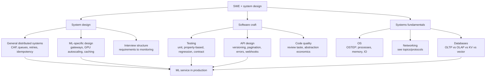

# SWE and System Design

Last updated: 2026-08-24

The engineering substrate under every ML service. Three pillars: **system design**
(general distributed systems plus the ML-specific serving layer), **software craft**
(testing, API design, code quality), and **systems fundamentals** (OS, networking,
databases; OSTEP territory). For an ML engineer they compose in one direction: the
fundamentals bound what a design can promise, the design shapes what code you write,
and the craft determines whether the whole thing survives contact with production.

## The map, briefly

**System design.** Two layers. The general layer is classic distributed systems:
consistency models, idempotency, backpressure, delivery semantics, database
selection. The ML layer sits on top and adds what makes model serving different from
CRUD: requests are expensive and long-lived (seconds of GPU time, streaming
responses), capacity is quantized in GPUs rather than fluid vCPUs, outputs are
nondeterministic so correctness is statistical, and cost per request is high enough
that caching, routing, and quota design dominate the architecture.

**Software craft.** Testing ML systems means testing three different things: code
(deterministic, unit-testable), data (schema and distribution checks), and model
behaviour (regression suites, LLM contract tests). API and library design is where
production experience shows: versioning discipline, idempotency keys, typed pydantic
contracts, and knowing when an abstraction earns its keep.

**Systems fundamentals.** Already largely covered elsewhere in this KB: OSTEP for OS,
[topics/protocols](../protocols/summary.md) for networking, and the database
taxonomy in [distributed-systems-basics.md](distributed-systems-basics.md) here.
The fundamentals matter in interviews mostly as justification: you defend a design
choice by naming the bottleneck (fsync latency, TCP slow start, page cache, GPU
memory bandwidth) rather than by pattern-matching.

## How they compose for an ML engineer

A representative production question: "serve an LLM feature to 10k tenants."
The answer walks all three pillars in order:

1. **Fundamentals** set the physics: one 70B model replica needs N GPUs, holds M
   concurrent KV caches, and cold-starts in minutes not milliseconds.
2. **General design** handles the traffic: gateway, queue with backpressure, retries
   with jitter and idempotency keys, per-tenant rate limits, OLTP store for state and
   OLAP store for usage analytics.
3. **ML design** handles the model: routing across model tiers, semantic and prefix
   caching, batch vs realtime split, shadow deployment for the new checkpoint,
   degradation ladder for when the GPU pool saturates.
4. **Craft** keeps it alive: contract tests on model outputs, regression evals in CI,
   API versioning so tenants survive the model swap.

That walk is also, almost verbatim, the ML system design interview.

## Deep dives

| File | What it covers |
|---|---|
| [ml-system-design.md](ml-system-design.md) | Designing LLM/ML services end to end: gateways, batch vs realtime, GPU autoscaling, caching, rate limiting, multi-tenancy, progressive rollout, failure modes; the interview structure |
| [distributed-systems-basics.md](distributed-systems-basics.md) | CAP and consistency models, idempotency, queues and backpressure, retries, delivery semantics, leader election, database taxonomy, event-driven architecture; DDIA as anchor |
| [testing-and-quality.md](testing-and-quality.md) | Testing ML systems: data transform units, property-based testing with Hypothesis, model regression suites, LLM contract tests, CI gates, GPU CI, general test taste |
| [api-and-code-design.md](api-and-code-design.md) | API design (versioning, pagination, idempotency keys, errors, webhooks), Python library design, code review taste, when abstraction pays |

## Related topics

- [topics/protocols](../protocols/summary.md): HTTP, gRPC, SSE, webhooks; the wire formats these designs run on
- [topics/inference-and-serving](../inference-and-serving/summary.md): the engine layer below the service layer designed here
- [topics/ml-infra-and-orchestration](../ml-infra-and-orchestration/summary.md): Kubernetes, Terraform, monitoring; how these designs get deployed
- [topics/evaluation-and-llm-judges](../evaluation-and-llm-judges/summary.md): the eval harnesses that back model regression testing

## Best resources (topic-wide)

- [Designing Data-Intensive Applications, 2nd ed.](https://dataintensive.net/) (Kleppmann and Riccomini, O'Reilly, March 2026): the anchor book for the whole topic
- [The System Design Primer](https://github.com/donnemartin/system-design-primer): 366k-star GitHub repo; the standard general system design interview prep
- [AI Engineering](https://huyenchip.com/books/) (Chip Huyen, O'Reilly 2025): the ML-specific serving and evaluation layer
- [Amazon Builders' Library](https://aws.amazon.com/builders-library/): short, battle-tested essays on retries, timeouts, backpressure, deployment safety
- [Google SRE Book](https://sre.google/sre-book/table-of-contents/): SLOs, error budgets, and the operational vocabulary interviews expect
