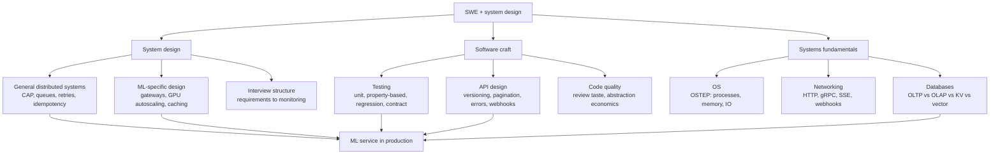

# Topic: swe-and-system-design

⏱ 9 min read · +44h resources

Last updated: 2026-09-21 (repaired the truncated last-updated note, replaced a repo-style reference in the taxonomy diagram, and tidied the fundamentals sentence)

The engineering substrate under every ML service. Three pillars: **system design**

(general distributed systems plus the ML-specific serving layer), **software craft**

(testing, API design, code quality), and **systems fundamentals** (OS, networking,

databases; OSTEP territory). For an ML engineer they compose in one direction: the

fundamentals bound what a design can promise, the design shapes what code you write,

and the craft determines whether the whole thing survives contact with production.

### The map, briefly

**System design.** Two layers. The general layer is classic distributed systems:

consistency models, idempotency, backpressure, delivery semantics, database

selection. The ML layer sits on top and adds what makes model serving different from

CRUD: requests are expensive and long-lived (seconds of GPU time, streaming

responses), capacity is quantized in GPUs rather than fluid vCPUs, outputs are

nondeterministic so correctness is statistical, and cost per request is high enough

that caching, routing, and quota design dominate the architecture.

**Software craft.** Testing ML systems means testing three different things: code

(deterministic, unit-testable), data (schema and distribution checks), and model

behaviour (regression suites, LLM contract tests). API and library design is where

production experience shows: versioning discipline, idempotency keys, typed pydantic

contracts, and knowing when an abstraction earns its keep.

**Systems fundamentals.** Already largely covered elsewhere in this KB: OSTEP for OS, [Topic: protocols](../protocols/summary.md) for networking, and the database taxonomy in [Distributed Systems Basics](distributed-systems-basics.md) and [Topic: databases](../databases/summary.md).

The fundamentals matter in interviews mostly as justification: you defend a design

choice by naming the bottleneck (fsync latency, TCP slow start, page cache, GPU

memory bandwidth) rather than by pattern-matching.

### What the named ideas actually are

The terms above are the vocabulary the rest of this topic is written in, so each gets a definition and a reason to care.

**CAP.** During a network partition a system can stay available or stay consistent, not both. Its more useful successor PACELC adds the healthy-network case: then the trade is latency against consistency. Why it matters: it turns "how consistent should this be" into a per-invariant question rather than a system-wide one, and the discipline is to pick the weakest level each invariant tolerates ("must not double-charge" needs linearizability or an idempotency key; "dashboard is 30 seconds stale" needs nothing at all).

**Idempotency.** An operation that can be applied twice with the effect of once. It is the highest-leverage property in service design because it makes retries safe, which makes at-least-once delivery tolerable, which in turn makes almost every other reliability mechanism simpler.

**Backpressure.** Propagating a consumer's inability to keep up back to the producer, through bounded buffers, 429 with Retry-After, or credit-based flow control. Why it matters: without it an unbounded queue converts overload into unbounded latency and then into metastable collapse, where the system stays broken after the load that broke it has gone away.

**Delivery semantics.** What a messaging layer promises. At-most-once loses messages; at-least-once duplicates them and is the practical default; exactly-once delivery is impossible over an unreliable network, so what real systems ship is at-least-once plus deduplication. That is why delivery semantics and idempotency are the same conversation.

**Database selection.** Choosing among transactional row stores, analytical column stores, key-value stores and vector indexes by access pattern rather than by familiarity. It matters because storage is the least reversible decision in a design: services can be rewritten in a sprint, a data model that answers the wrong questions cannot.

**Property-based testing.** Rather than hand-picking examples, you state an invariant (normalisation never introduces a NaN; a vectorised implementation matches the slow reference loop) and a generator searches for a counterexample, then shrinks it to the smallest failing input. **Hypothesis** is the Python implementation, with generators for numpy arrays and dataframes. Why it matters for ML code: shape, dtype and numerical invariants are exactly what an example-based test misses and a search finds.

**Model regression suites.** A versioned golden set scored against the incumbent's stored scores, failing the build on a drop beyond a noise threshold. They play the role for a checkpoint or prompt change that unit tests play for code, which is the only way a nondeterministic component can be gated at merge time rather than watched on a dashboard.

**LLM contract tests.** Validation that a model's output conforms to the schema downstream code expects: field types, enum membership, IDs that resolve against the catalogue, citation indices in range. Why it matters: it moves a prompt or checkpoint regression from a production incident to a CI failure.

**pydantic.** The Python library that parses input into typed models and validates it at the boundary, instead of checking dictionaries by hand deep in the call stack. It is where the contracts above are actually written, and where config, request bodies and structured LLM output all get the same treatment.

**API versioning discipline.** Every breaking change (removing or renaming a field, tightening validation, changing semantics) gets a new version, and existing consumers keep the semantics they onboarded with. It matters more for ML services than for CRUD ones because the model is itself part of the contract surface: swapping a checkpoint changes observable behaviour without changing a single field.

**Idempotency keys.** The client-supplied token that manufactures idempotency where the operation has none: the server atomically records key to response and replays the stored response on a retry. This is the concrete mechanism that makes a client retry policy safe on POST.

**OSTEP.** Operating Systems: Three Easy Pieces, the free Wisconsin textbook organised around virtualisation, concurrency and persistence. It is the reference for the OS layer of the fundamentals, and it earns the time because its three-way split reappears in GPU serving almost directly: address spaces and paging map onto KV cache block management, and scheduling onto continuous batching.

**The bottlenecks worth being able to name.** **fsync latency**, roughly a millisecond, is what a durable write costs when it must actually reach stable storage, and it caps write throughput per transaction. **TCP slow start** is the congestion window ramping up from small on a new connection, which is why short-lived connections underuse the link and why connection reuse and HTTP/2 multiplexing pay. The **page cache** is the OS holding recently used file pages in RAM, which is why a "disk read" is often free and why memory pressure surfaces as unexplained IO. **GPU memory bandwidth** is the ceiling on decode throughput, because generating one token reads the whole weight set once and is memory-bound rather than compute-bound, which is the physical fact behind continuous batching, KV cache design, and quantisation.

### How they compose for an ML engineer

A representative production question: "serve an LLM feature to 10k tenants."

The answer walks all three pillars in order:

1. **Fundamentals** set the physics: one 70B model replica needs N GPUs, holds M concurrent KV caches, and cold-starts in minutes not milliseconds.
2. **General design** handles the traffic: gateway, queue with backpressure, retries with jitter and idempotency keys, per-tenant rate limits, OLTP store for state and OLAP store for usage analytics.
3. **ML design** handles the model: routing across model tiers, semantic and prefix caching, batch vs realtime split, shadow deployment for the new checkpoint, degradation ladder for when the GPU pool saturates.
4. **Craft** keeps it alive: contract tests on model outputs, regression evals in CI, API versioning so tenants survive the model swap.
That walk is also, almost verbatim, the ML system design interview.

### Deep dives

| Page | What it covers |
| --- | --- |
| [ML System Design: LLM and ML Services](ml-system-design.md) (12 min read · +24h 25m resources) | Designing LLM/ML services end to end: gateways, batch vs realtime, GPU autoscaling, caching, rate limiting, multi-tenancy, progressive rollout, failure modes; the interview structure |
| [Distributed Systems Basics](distributed-systems-basics.md) (11 min read · +18h 55m resources) | CAP and consistency models, idempotency, queues and backpressure, retries, delivery semantics, leader election, database taxonomy, event-driven architecture; DDIA as anchor |
| [Testing and Quality for ML Systems](testing-and-quality.md) (10 min read · +3h 40m resources) | Testing ML systems: data transform units, property-based testing with Hypothesis, model regression suites, LLM contract tests, CI gates, GPU CI, general test taste |
| [API and Code Design](api-and-code-design.md) (11 min read · +9h 15m resources) | API design (versioning, pagination, idempotency keys, errors, webhooks), Python library design, code review taste, when abstraction pays |

Also under this topic, outside the table above: the [AI Engineering Skills Map: software engineering fundamentals (Andrew Ng, 2026)](ai-engineering-skills-map.md) (6 min read · +10 min resources), which maps Andrew Ng's five software-fundamentals pillars onto where this KB covers each one and flags the two gaps (front-end proper, and conventional application security).

### Related topics

- [Topic: protocols](../protocols/summary.md): HTTP, gRPC, SSE, webhooks; the wire formats these designs run on
- [Topic: inference-and-serving](../inference-and-serving/summary.md): the engine layer below the service layer designed here
- [Topic: ml-infra-and-orchestration](../ml-infra-and-orchestration/summary.md): Kubernetes, Terraform, monitoring; how these designs get deployed
- [Topic: evaluation-and-llm-judges](../evaluation-and-llm-judges/summary.md): the eval harnesses that back model regression testing
- [Topic: databases](../databases/summary.md): the storage layer these designs sit on, the database families compared directly, and caching (every layer from CPU to CDN, plus the LLM caches) as a deep dive under it

### Best resources (topic-wide)

- [Designing Data-Intensive Applications, 2nd ed.](https://dataintensive.net/) (book, ~15h): Kleppmann and Riccomini, O'Reilly, March 2026; the anchor book for the whole topic
- [The System Design Primer](https://github.com/donnemartin/system-design-primer) (repo, ~2h for the core sections): 366k-star GitHub repo; the standard general system design interview prep
- [AI Engineering](https://huyenchip.com/books/) (book, ~13h): Chip Huyen, O'Reilly 2025; the ML-specific serving and evaluation layer
- [Amazon Builders' Library](https://aws.amazon.com/builders-library/) (essay collection, ~2h for the core essays): short, battle-tested essays on retries, timeouts, backpressure, deployment safety
- [Google SRE Book](https://sre.google/sre-book/table-of-contents/) (book, ~12h; ~1h for ch. 4 and 22 alone): SLOs, error budgets, and the operational vocabulary interviews expect
- [ML System Design: LLM and ML Services](ml-system-design.md)
- [Distributed Systems Basics](distributed-systems-basics.md)
- [Testing and Quality for ML Systems](testing-and-quality.md)
- [API and Code Design](api-and-code-design.md)
- [AI Engineering Skills Map: software engineering fundamentals (Andrew Ng, 2026)](ai-engineering-skills-map.md)
